**PHP** DESARROLLO WEB EN ENTORNO SERVIDOR
====

*Versión 3*

Profesor: Frago, A 


Contenido
-----

[1 Introducción a PHP](#_Toc518750153)

* [1.1 ¿Qué es PHP?](#qué-es-php)

    -   [1.1.1 Historia](#historia)

    -   [1.1.2 Características](#características)

    -   [1.1.3 Inconvenientes:](#inconvenientes)

    -   [1.1.4 ¿Cómo son y cómo funcionan las páginas
dinámicas?](#cómo-son-y-cómo-funcionan-las-páginas-dinámicas)

* [1.2 Sintaxis básica](#sintaxis-básica)

    -   [1.2.1 Etiquetas de PHP](#etiquetas-de-php)

    -   [1.2.2 Incrustando código PHP dentro de HTML](#incrustando-código-php-dentro-de-html)

    -   [1.2.3 Salir de HTML](#salir-de-html)

    -   [1.2.4 Separación de instrucciones](#separación-de-instrucciones)

* [1.2. Comentarios](#comentarios)

* [1.3 Variables](#variables)

    -   [1.3.1 Conceptos básicos](#conceptos-básicos)

    -   [1.3.2 Convención de nombres en PHP:](#convención-de-nombres-en-php)

* [1.4 Tipos primitivos](#tipos-primitivos)

    -   [1.4.1 Tipos escalares](#tipos-escalares)

    -   [1.4.2 Tipos compuestos](#tipos-compuestos)

* [1.5 Constantes](#constantes)

* [1.6 Operadores](#operadores)

* [1.7 Mostrar mensajes por pantalla](#mostrar-mensajes-por-pantalla)

    -   [1.7.1 Echo](#echo)

    -   [1.7.2 El comando print de PHP](#el-comando-print-de-php)

* [1.8 Estructuras de control](#estructuras-de-control)

    -   [1.8.1 Condicionales](#condicionales)

    -   [1.8.2 Bucles](#bucles)

* [1.9 Funciones](#funciones)

    -   [1.9.1 Ámbito de las variables](#ámbito-de-las-variables)

* [1.10 Ejercicio PHP: Sintaxis](#ejercicio-php-sintaxis)

[2 PHP Avanzado](#php-avanzado)

* [2.1 Uso básico de SimpleXML](#uso-básico-de-simplexml)

    -   [2.1.1 Lectura desde un archivo JSon](#lectura-desde-un-archivo-json)

* [2.2 Pasar variables por la URL con PHP](#pasar-variables-por-la-url-con-php)

    -   [2.2.1 Procesar variables de formularios. POST en
PHP](#procesar-variables-de-formularios.-post-en-php)

* [2.3 Fecha y hora](#fecha-y-hora)

* [2.4 Incluyendo un archivo PHP en otro archivo
PHP](#incluyendo-un-archivo-php-en-otro-archivo-php)

    -   [2.4.1 Diferencias entre las sentencias include y
require](#diferencias-entre-las-sentencias-include-y-require)

* [2.5 Trabajando con archivos en PHP](#trabajando-con-archivos-en-php)

    -   [2.5.1 Abriendo un archivo haciendo uso de
fopen()](#abriendo-un-archivo-haciendo-uso-de-fopen)

    -   [2.5.2 Cerrando un archivo haciendo uso de
fclose()](#cerrando-un-archivo-haciendo-uso-de-fclose)

    -   [2.5.3 Leyendo de un archivo haciendo uso de
fread()](#leyendo-de-un-archivo-haciendo-uso-de-fread)

    -   [2.5.4 Escribiendo un archivo haciendo uso de
fwrite()](#escribiendo-un-archivo-haciendo-uso-de-fwrite)

* [2.6 Sesiones y Coockies](#sesiones-y-coockies)

    -   [2.6.1 Sesiones](#sesiones)

    -   [2.6.2 Cookies en PHP](#cookies-en-php)

* [2.7 Funciones varias](#funciones-varias)

    -   [2.7.1 exit(\[\$string\]) /
die(\[\$string\])](#exitstring-diestring)

    -   [2.7.2 eval(\$string)](#evalstring)

    -   [2.7.3 isset(\$var)](#issetvar)

    -   [2.7.4 sleep(\$integer)](#sleepinteger)

* [2.8. string urlencode ( string \$str )](#string-urlencode-string-str)

    -   [2.8.1 var\_dump ()](#var_dump)

    -   [2.8.2 header()](#header)

[2.9 Variables predefinidas](#variables-predefinidas)

[3 PHP Orientado a Objeto](#php-orientado-a-objeto)

* [3.1 Nuestros principios como
desarrolladores](#nuestros-principios-como-desarrolladores)

    -   [3.1.1 3 principios para simplificar tu vida como
desarrollador](#principios-para-simplificar-tu-vida-como-desarrollador)

* [3.2 Conceptos básicos](#conceptos-básicos-1)

* [3.3 Objetos en PHP](#objetos-en-php)

    -   [3.3.1 La clase](#la-clase)

    -   [3.3.2 Instanciar una clase](#instanciar-una-clase)

    -   [3.3.3 Propiedades en PHP](#propiedades-en-php)

    -   [3.3.4 Accediendo a las propiedades de un
objeto](#accediendo-a-las-propiedades-de-un-objeto)

* [3.3. Constantes de clases](#constantes-de-clases)

* [3.4 Métodos en PHP](#métodos-en-php)

    -   [3.4.1 Ejemplos: Trabajando con objetos y métodos en
PHP](#ejemplos-trabajando-con-objetos-y-métodos-en-php)

* [3. [Herencia en PHP](#herencia-en-php)

    -   [3.5.1 Declaración de clases abstractas](#declaración-de-clases-abstractas)

    -   [3.5.2 Herencia de clases](#herencia-de-clases)

    -   [3.5.3 Métodos abstractos](#métodos-abstractos)

    -   [3.5.4 Métodos mágicos](#métodos-mágicos)

* [3.5. Ejemplos: Herencia en PHP](#ejemplos-herencia-en-php)

* [3.6 Interfaces](#interfaces)

* [3.7 Excepciones](#excepciones)

    -   [3.7.1 Lanzamiento y captura de excepciones](#lanzamiento-y-captura-de-excepciones)

* [3.8 Ejercicios:](#ejercicios)

[4 PHP -- Base de Datos](#php-base-de-datos)

* [4.1 MySQL](#mysql)

* [4.2 PhpMyAdmin](#phpmyadmin)

    -   [4.2.1 ¿Qué es PhpMyAdmin?](#qué-es-phpmyadmin)

    -   [4.2.2 Acceder a phpMyAdmin desde Xampp](#acceder-a-phpmyadmin-desde-xampp)

    -   [4.2.3 Crear base de datos](#crear-base-de-datos)

    -   [4.2.4 Crear una tabla](#crear-una-tabla)

    -   [4.2.5 Controladores de MySQL para PHP](#controladores-de-mysql-para-php)

* [5.1 Elegir una API](#elegir-una-api)

    -   [5.1.1 Comparación de las APIs de MySQL](#comparación-de-las-apis-de-mysql)

    -   [5.1.2 Ejemplos básicos de la extensión
MySQLi](#_Toc518750239)

* [5.2 Ejercicios](#ejercicios-1)

[6 Desarrollo de Aplicaciones con PHP](#desarrollo-de-aplicaciones-con-php)

* [6.1 Arquitectura en 3 capas](#arquitectura-en-3-capas)

    -   [6.1.1 Persistencia](#persistencia)

* [6.2 Modelo-Vista-Controlador](#modelo-vista-controlador)

    -   [6.2.1 ¿Cómo funciona el patrón MVC?](#cómo-funciona-el-patrón-mvc)

* [6.3 Diferencias entre arquitectura en 3 capas y
Modelo-Vista-Controlador](#diferencias-entre-arquitectura-en-3-capas-y-modelo-vista-controlador)

    -   [6.3.1 La Arquitectura MVC](#la-arquitectura-mvc)

    -   [6.3.2 Arquitectura de 3 niveles](#arquitectura-de-3-niveles)

    -   [6.3.3 Ejercicios](#ejercicios-2)

* [6.4 Google Auth.](#google-auth.)

    -   [6.4.1 Autentificación externa](#autentificación-externa)

    -   [6.4.2 Habilitar Google+ API](#habilitar-google-api)

    -   [6.4.3 Habilitar el servicio de Google+ API](#habilitar-el-servicio-degoogle-api)

    -   [6.4.4 Generar credenciales](#generar-credenciales)

* [6.5. Composer: Gestión de dependencias](#composer-gestión-de-dependencias)

    -   [6.5.1 Integrar acceso vía Google](#integrar-acceso-vía-google)

* [6.6. Envio de correos](#envió-de-correos)

    -   [6.6.1 PHP Mailer](#php-mailer)

Introducción a PHP
==================

¿Qué es PHP?
------------

PHP (Hypertext Preprocessor) es un lenguaje de código abierto muy
popular especialmente adecuado para el desarrollo web y que puede ser
incrustado en HTML. Es un lenguaje utilizado para hacer que el servidor
generé contenido dinámicamente cada vez que un navegador realiza una
petición de una página web. Los scripts de PHP son ejecutados en el lado
del servidor y el resultado es retornado al navegador en HTML plano.

*Simple y escalable a la vez que poderoso, PHP va a ser el lenguaje que
aprenderemos a lo largo de los siguientes capítulos.*

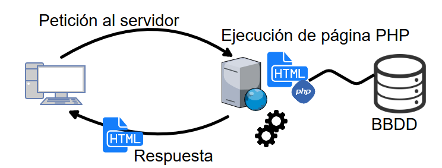

# 1.  Funcionamiento de PHP.

### Historia

Fue creado originalmente por Rasmus Lerdorf en el año 1995. Este
lenguaje forma parte del software libre publicado bajo la licencia PHP,
que es incompatible con la Licencia Pública General de GNU debido a las
restricciones del uso del término PHP.2​

En mayo del 2000, PHP 4 se lanzó bajo el poder del motor Zend 1.0. El 13
de julio del 2007 se anunció la suspensión del soporte y desarrollo de
la versión 4 de PHP.

El 13 de julio del 2004, se lanzó PHP 5, utilizando el motor Zend Engine
2.0 (o Zend Engine 2). Incluye todas las ventajas que provee el nuevo
Zend Engine 2, como:

-   Mejor soporte para la programación orientada a objetos, que en
    versiones anteriores era extremadamente rudimentario.

-   Mejoras de rendimiento.

-   Mejor soporte para MySQL con extensión completamente reescrita.

-   Mejor soporte a XML (XPath, DOM, etc.).

-   Soporte nativo para SQLite.

-   Soporte integrado para SOAP.

-   Iteradores de datos.

-   Manejo de excepciones.

-   Mejoras con la implementación con Oracle.

Se utiliza PHP en millones de sitios; entre los más destacados se
encuentran Wikipedia.org, Facebook.com y Wordpress.com.
([Wikipedia](https://es.wikipedia.org/wiki/PHP))

### Características

-   Orientado al desarrollo de **aplicaciones web dinámicas** con acceso
    a información almacenada en una base de datos.

-   Es considerado **un lenguaje fácil de aprender**, ya que en su
    desarrollo se simplificaron distintas especificaciones, como es el
    caso de la definición de las variables primitivas, ejemplo que se
    hace evidente en el uso de [php
    arrays](https://es.wikipedia.org/wiki/Php_arrays).

-   El código fuente escrito en **PHP es invisible al navegador web** y
    al cliente, ya que es el servidor el que se encarga de ejecutar el
    código y enviar su resultado HTML al navegador.

-   **Capacidad de conexión con la mayoría de los motores de base de
    datos** que se utilizan en la actualidad, destaca su conectividad
    con **MySQL**
    y [PostgreSQL](https://es.wikipedia.org/wiki/PostgreSQL).

-   **Capacidad de expandir** su potencial **utilizando módulos**
    (llamados *ext\'s* o extensiones).

-   Posee una **amplia documentación** en su sitio web oficial, entre la
    cual se destaca que todas las funciones del sistema están explicadas
    y ejemplificadas en un único archivo de ayuda.

-   **Es libre**, por lo que se presenta como una alternativa de fácil
    acceso para todos.

-   Permite aplicar técnicas de programación **orientada a objetos.**

-   **No requiere definición de tipos de variables** aunque sus
    variables se pueden evaluar también por el tipo que estén manejando
    en tiempo de ejecución.

-   Tiene **manejo de excepciones** (desde PHP5).

-   Si bien PHP no obliga a quien lo usa a seguir una determinada
    metodología a la hora de programar, aun haciéndolo, el programador
    puede aplicar en su trabajo cualquier técnica de programación o de
    desarrollo que le permita escribir código ordenado, estructurado y
    manejable. Un ejemplo de esto son los desarrollos que en PHP se han
    hecho del patrón de diseño **Modelo Vista Controlador (MVC)**, que
    permiten separar el tratamiento y acceso a los datos, la lógica de
    control y la interfaz de usuario en tres componentes independientes.

-   Debido a su flexibilidad ha tenido una gran acogida como lenguaje
    base para las aplicaciones WEB de manejo de contenido, y es su uso
    principal.

### Inconvenientes:

-   Como es un lenguaje que se interpreta en ejecución, para ciertos
    usos puede resultar un inconveniente que el código fuente no pueda
    ser ocultado. La ofuscación es una técnica que puede dificultar la
    lectura del código pero no necesariamente impide que el código sea
    examinado.

-   Debido a que es un lenguaje interpretado, un script en PHP suele
    funcionar considerablemente más lento que su equivalente en un
    lenguaje de bajo nivel, sin embargo, este inconveniente se puede
    minimizar con técnicas de caché[ ]tanto en archivos como
    en memoria.

-   En las versiones previas a la 7, las variables no son tipificadas,
    lo cual dificulta a los diferentes IDEs ofrecer asistencias para el
    tipificado del código, aunque esto no es realmente un inconveniente
    del lenguaje en sí.

-   Esto es solventado por algunos IDEs añadiendo un comentario con el
    tipo a la declaración de la variable.

[*Wikipedia*](https://es.wikipedia.org/wiki/PHP)

### ¿Cómo son y cómo funcionan las páginas dinámicas?

Para la ejecución de PHP es necesario disponer de un servidor Web. Los
servidores web más utilizados son **Apache** (para servidores con
sistema operativo Linux) y **Microsoft IIS** (para servidores con
sistema operativo Windows). El servidor Web se encargará de interpretar
el código PHP, generar la página HMTL correspondiente y entregársela al
usuario que la ha solicitado a través de su navegador (Microsoft Edge,
Google Chrome, Mozilla Firefox...).

Hasta el momento hemos estudiado qué son las páginas HTML y cómo se
complementan con las hojas de estilos CSS o con JavaScript. Las páginas
HTML son estáticas, esto es, su contenido no varía. Sin embargo, creando
scripts PHP podemos construir páginas web dinámicas (las que tienen
extensión .php en este caso) que son interpretadas por el servidor y el
resultado de este procesamiento se sirve al cliente como si de un
documento HTML se tratase.

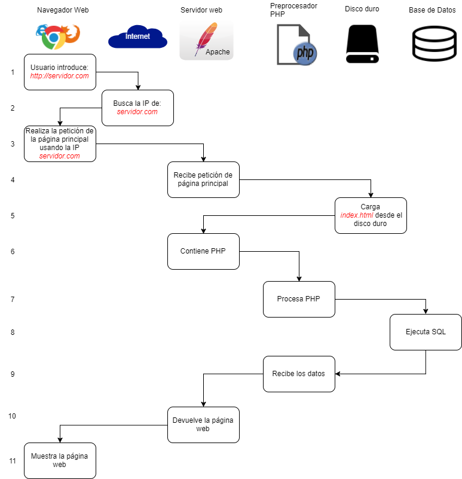

2.  Funcionamiento de las Web dinámicas.

Veamos un ejemplo sencillo.

El siguiente script PHP (*fechahora.php*) devuelve la fecha y la hora
del servidor.
````php
<?php
    $fecha = date("d/m/Y");
    $hora = date("h:i:s");
?>
<html>
    <head>
        <title>Fecha y hora</title>
    </head>
    <body>
        <p><?php echo "Hola Mundo. Hoy es ".$fecha.". "; ?></p>
        <p><?php echo "Hora: ".$hora; ?></p>
    </body>
</html>
````

Para ejecutar este script PHP, ubicado en el servidor web, debemos
acceder desde un navegador web a una URL de este tipo:
[http://www.example.com/fechahora.php](http://www.example.com/fechahora.php)

En este ejemplo utilizamos *\<?php* para indicar el inicio de una
etiqueta de PHP. Después ponemos la sentencia y abandonamos el modo PHP
añadiendo la etiqueta de cierre *?\>*. De esta manera, se puede entrar y
salir del modo PHP en un fichero HTML cada vez que se quiera. 

Sintaxis básica
---------------

### Etiquetas de PHP

Cuando PHP analiza un fichero, busca las etiquetas de apertura y cierre,
que son *\<?php* y *?\>*, que indican a PHP dónde empezar y finalizar la
interpretación del código. Este mecanismo permite embeber a PHP en todo
tipo de documentos, ya que todo lo que esté fuera de las etiquetas de
apertura y cierre de PHP será ignorado por el analizador.

````php
<?php
echo "Hola mundo";
// ... más código
echo "Última sentencia";
// el script finaliza aquí sin etiqueta de cierre de PHP
````


### Incrustando código PHP dentro de HTML

````html
<!DOCTYPE html>
<html>
  <head>
     <meta charset="UTF-8">
      <title>Un simple archivo PHP</title>
  </head>
  <body>
    <h1><?php echo "Hola mundo!"; ?></h1>
  </body>
</html>
````

### Salir de HTML

Cualquier cosa fuera de un par de etiquetas de apertura y cierre es
ignorada por el intérprete de PHP, lo que permite que los ficheros de
PHP tengan contenido mixto. Esto hace que PHP pueda ser embebido en
documentos HTML para, por ejemplo, crear plantillas.

````php
<p>Esto va a ser ignorado por PHP y mostrado por el navegador.</p>
<?php echo 'Mientras que esto va a ser interpretado.'; ?>
<p>Esto también será ignorado por PHP y mostrado por el navegador.</p>
````

### Separación de instrucciones

PHP es un lenguaje bastante sencillo basado en Perl y C, pero que se
parece más a Java. Como en C o en Perl, PHP requiere que las
instrucciones terminen en punto y coma al final de cada sentencia. La
etiqueta de cierre de un bloque de código de PHP automáticamente implica
un punto y coma; no es necesario usar un punto y coma para cerrar la
última línea de un bloque de PHP. La etiqueta de cierre del bloque
incluirá la nueva línea final inmediata si está presente.

````php
<?php
    echo 'Esto es una prueba';
?>
<?php echo 'Esto es una prueba' ?>
<?php echo 'Hemos omitido la última etiqueta de cierre';
````

### Comentarios

PHP admite comentarios al estilo de \'C\', \'C++\' y de consola de Unix
(estilo de Perl). Por ejemplo:

````php
<?php
    // Esto es un comentario al estilo de c++ de una sola línea
    echo 'Esto es una prueba';
    /* Esto es un comentario multilínea
     y otra línea de comentarios */
    echo 'Esto es otra prueba';
    echo 'Una prueba final';
    # Esto es un comentario al estilo de consola de una sola línea
?>
````

Variables
---------

### Conceptos básicos

En PHP las variables se representan con un signo de dólar seguido por el
nombre de la variable, ya sea un número, string o array, debe tener este
símbolo por delante.

````php
<?php
    $cnt = 0;
    $str = "cadena de texto ";
    $array = array("Uno", "Dos");
?>
````

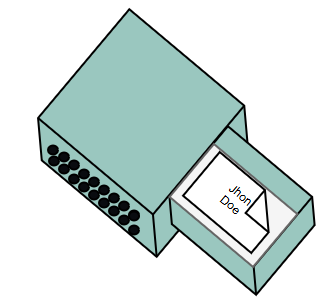
3.  Metáfora de las variables.

> Existe una sencilla metáfora para explicar
el concepto de las variables, imagina que tuvieras de una caja de
cerillas en la que introdujeras un papel con tu nombre escrito. El mismo
proceso se realiza a la hora de almacenar un valor string en una
variable.
````php
$username = "Jhon Doe";
````


### Convención de nombres en PHP:

Estas son las siguientes reglas para nombrar una variable PHP:

-   Todas las variables en PHP comienzan con un signo \$, seguido del
    nombre de la variable.

-   El nombre de una variable debe comenzar con una letra o el carácter
    de subrayado \_.

-   El nombre de una variable no puede comenzar con un número.

-   Un nombre de variable en PHP sólo puede contener caracteres
    alfanuméricos y subrayados (A-z, 0-9 y \_).

-   El nombre de una variable no puede contener espacios.

````php
<?php
  $txt = "Hola mundo!";
  $number = 10;
  // Muestra los valores de las variables
  echo $txt;
  echo "<br>";
  echo $number;
?>
````

El tipo de datos de una variable determina los posibles valores que ésta
puede tomar, este se determina en el momento de asignarle un valor a una
variable. Esto implica que en cada asignación el tipo de dato de una
variable pude cambiar, en función del valor asignado o de la operación
realizada.

````php
<?php
  $number1 = 31; // integer
  $number2 = 5.12; // float
  echo "<p>La suma de $number1 y $number2 es ".($number1+$number2)."</p>"
?>
````

Como se puede apreciar en este ejemplo, el resultado de sumar un número
entero integer y un decimal float da como resultado un valor decimal
float.

Podemos apreciar cómo realizar la concatenación de cadenas de texto
haciendo uso del operador. (punto).

Tipos primitivos
----------------

PHP admite nueve tipos primitivos.

Cuatro tipos escalares:

-   [**boolean**](http://php.net/manual/es/language.types.boolean.php)

-   [**integer**](http://php.net/manual/es/language.types.integer.php)

-   [**float**](http://php.net/manual/es/language.types.float.php) (número
    de punto flotante, también conocido
    como [double](http://php.net/manual/es/language.types.float.php))

-   [**string**](http://php.net/manual/es/language.types.string.php)

Cuatro tipos compuestos:

-   [**array**](http://php.net/manual/es/language.types.array.php)

-   [object](http://php.net/manual/es/language.types.object.php)

-   [callable](http://php.net/manual/es/language.types.callable.php)

-   iterable

Y finalmente dos tipos especiales:

-   [resource](http://php.net/manual/es/language.types.resource.php)

-   [NULL](http://php.net/manual/es/language.types.null.php)

### Tipos escalares

Los tipos de datos básicos en PHP son:

#### Boolean

Lógica, puede tener dos tipos de valores; verdadero (TRUE) o falso
(FALSE).
`````php
<?php
    // Asignar el valor TRUE a una variable
    $show_error = true;
    var_dump($show_error);
?>
`````

#### Integer

Valores enteros, tanto positivos como negativos
`````php
<?php  
  $a = 123; // Número decimal
  var_dump($a);
  echo "<br>";
  $b = -123; // un número negativo
  var_dump($b);
  echo "<br>";
  $c = 0x1A; // número hexadecimal
  var_dump($c);
  echo "<br>";
  $d = 0123; // número octal 
  var_dump($d);
?>
`````

#### Float

Valores numéricos con parte decimal, tanto positivos como negativos.
`````php
<?php
    $a = 1.234;
    var_dump($a);
    echo "<br>";
    $b = 10.2e3;
    var_dump($b);
    echo "<br>";
    $c = 4E-10;
    var_dump($c);
?>


#### String

Cadena de caracteres delimitada por comillas.

<?php
    $a = 'Hola mundo!';
    echo $a;
    echo "<br>";
    $b = "Hello world!";
    echo $b;
    echo "<br>";
    $c = 'Stay here, I\'ll be back.';
    echo $c;
?>
`````

Un string, o cadena, es una serie de caracteres donde cada carácter es
lo mismo que un byte. Esto significa que PHP solo admite un conjunto de
256 caracteres, y de ahí que no ofrezca soporte nativo para Unicode.
Véanse los detalles del tipo string.

Un literal de tipo string se puede especificar con entrecomillado simple
y doble.

#### Entrecomillado simple

La manera más sencilla de especificar un string es delimitarlo con
comillas simples (el carácter \' ).

Para especificar una comilla simple literal, se ha de escapar con una
barra invertida (*\\*). Para especificar una barra invertida literal, se
duplica (*\\\\*). Todas las demás instancias de barras invertidas serán
tratadas como una barra invertida literal: esto significa que otras
secuencias de escape que podrían utilizarse, tales como *\\r* o *\\n*,
serán mostradas literalmente tal y como se especifican, en lugar de
tener cualquier otro significado especial.
`````php
<?php
  echo 'Esto es una cadena sencilla';
  echo 'También se pueden incluir nuevas líneas en
  un string de esta forma, ya que es
  correcto hacerlo así';
  // Resultado: Arnold una vez dijo: "I'll be back"
  echo 'Arnold una vez dijo: "I\'ll be back"';
  // Resultado: Ha borrado C:\*.*?
  echo 'Ha borrado C:\\*.*?';
  // Resultado: Ha borrado C:\*.*?
  echo 'Ha borrado C:\*.*?';
  // Resultado: Esto no se expandirá: \n una nueva línea
  echo 'Esto no se expandirá: \n una nueva línea';
  // Resultado: Las variables $tampoco se $expandirán
  echo 'Las variables $tampoco se $expandirán';
?>
`````

#### Entrecomillado doble

La característica más importante del entrecomillado doble es que las
variables que haya dentro de dicho string se analizan.

Las comillas simples Interpretan el texto literalmente, mientras que las
dobles sustituyen las variables. Por ejemplo, \$cant=8; echo \'Son
\$cant euros\'; dará como resultado Son \$cant euros. Pero \$cant=8;
echo \"Son \$cant euros\"; imprimirá Son 8 euros.

Si un string está delimitado con comillas dobles (\"), PHP interpretará
las siguientes secuencias de escape como caracteres especiales:

  **Secuencia**   **Significado**
  --------------- ----------------------
  *\\n*           avance de línea
  *\\r*           retorno de carro
  *\\t*           tabulador horizontal

4.  Caracteres especiales.

### Tipos compuestos

#### Array

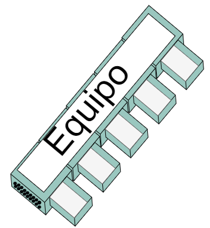
5.  Metáfora de los arrays.

> Podemos pensar en un array como un
conjunto de cajas de cerillas pegados una a la otra. Por ejemplo,
digamos que queremos almacenar los nombres de cinco jugadores de un
equipo de futbol en un array llamado \$equipo. Para hacer esto sería
como poner cinco cajas de cerillas una al lado de la otra e introducir
en cada una de ellas un papel con el nombre del jugador correspondiente.

````php
$equipo = array(\"pl1\",\"pl2\",\"pl3\",\"pl4\",\"pl5\");
````


Un array en PHP es en realidad un mapa ordenado. Un mapa es un tipo de
datos que asocia *valores* con *claves*. Este tipo se optimiza para
varios usos diferentes; se puede emplear como un array, lista (vector),
tabla asociativa (tabla hash - una implementación de un mapa),
diccionario, colección, pila, cola, y posiblemente más. Ya que los
valores de un array pueden ser otros arrays, también son posibles
árboles y arrays multidimensionales.

Un array puede ser creado con el constructor del lenguaje  array(). Éste
toma cualquier número de parejas *clave =\> valor* como argumentos.
`````php
array(
    clave  => valor,
    clave2 => valor2,
    clave3 => valor3,
    ...
)
`````

La coma después del último elemento del array es opcional, pudiéndose
omitir. 

#### Un array simple
`````php
<?php
  $array = array(
    "foo" => "bar",
    "bar" => "foo",
  );
  // a partir de PHP 5.4
  $array = [
    "foo" => "bar",
    "bar" => "foo",
  ];
?>
`````

#### Arrays indexados sin clave
`````php
<?php
  $array = array("foo", "bar", "hola", "mundo");
  var_dump($array);
?>
`````

#### Claves no en todos los elementos
`````php
<?php
  $array = array(
         "a",
         "b",
    6 => "c",
         "d",
  );
  var_dump($array);
?>
`````

#### Array bidimensionales

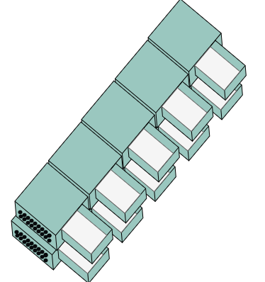

> Se
pueden hacer muchas más cosas con los arrays, en lugar de tener una
única línea de cajas de cerillas, podemos disponer de una línea de cajas
encima de otra o incluso más.

6.  Metáfora de los arrays bidimensionales.

Acceso a elementos de array con la sintaxis de corchete. Los elementos
de array se pueden acceder utilizando la sintaxis array\[key\].
`````php
<?php
  $array = array(
    "foo" => "bar",
    42    => 24,
    "multi" => array(
             "dimensional" => array(
             "array" => "foo"
           )
     )
  );
  var_dump($array["foo"]);
  var_dump($array[42]);
  var_dump($array["multi"]["dimensional"]["array"]);
?>
`````

#### Objeto

Para crear un nuevo object, utilice la sentencia new para instanciar una
clase:
`````php
<?php
  class foo
  {
    function hacer_algo()
    {
        echo "Haciendo algo."; 
    }
  }
  $bar = new foo;
  $bar->hacer_algo();
?>
`````

Constantes
----------

Las constantes son parecidas a las variables, pero con la diferencia de
que su valor nunca cambia y es utilizado repetidamente.

Ejemplos comunes de estos datos incluyen ajustes de configuración como
nombre de usuario y contraseña de la base de datos, URL base del sitio
web, nombre de la empresa, etc.

Para crear una constante es necesario hacer uso de la función
**define,** pasándole como parámetros el nombre de la constante y su
valor.

````php
<?php
  // Defining constant
  define("SITE_URL", "https://www.cuatrovientos.org/");

  // Using constant
  echo 'Thank you for visiting - ' . SITE_URL;
?>
````

A diferencia de las variables, las constantes no llevan por delante el
símbolo \$ y se escriben con mayúsculas.

 Operadores
-----------

Un operador es algo que toma uno más valores (o expresiones, en la jerga
de programación) y produce otro valor (de modo que la construcción en si
misma se convierte en una expresión).

#### Operadores básicos


| **Ejemplo** | **Nombre** | **Resultado** |
|--|--|--|
| \$a + \$b  | Adición | Suma de *\$a* y *\$b* |
| \$a - \$b  | Sustracción | Diferencia de *\$a* y *\$b* |
| \$a \* \$b  | Multiplicación | Producto de *\$a* y *\$b* |
| \$a / \$b | División | Cociente de *\$a* y *\$b* |
| \$a % \$b | Módulo | Resto de *\$a* dividido por *\$b* |
| \$a \*\* \$b | Exponenciación | Resultado de elevar *\$a* a la potencia *\$b* enésima  |

7.  Operadores básicos.


#### Operadores de asignación

| **Ejemplo**  | **Nombre**  | **Resultado**  |
|--|--|--|
| \$a = \$b  |  Asignación  | Asigna valor de *\$a* a *\$b*  |
|  \$a += \$b | Sumar  | Suma de *\$a* y *\$b*  |
| \$a -= \$b  |  Restar | Diferencia de *\$a* y *\$b*  |
| \$a \*= \$b  | Multipllicar  | Producto de *\$a* y *\$b*  |
| \$a /= \$b  | Dividir  | Cociente de *\$a* y *\$b*  |
| \$a %= \$b  | Módulo  | Resto de *\$a* dividido por *\$b  |
| \$a .= \$b  | Concatenación  | Resultado de elevar *\$a* a la potencia *\$b*ésima.  |

8.  Operadores de asignación.

#### Operadores de comparación

| **Ejemplo**  | **Nombre**  | **Resultado**  |
|--|--|--|
|  \$a \> \$b  | Mayor que  | *\$a* es mayor que *\$b*  |
| \$a \< \$b  | Menor que | *\$a*  es menor que *\$b*  |
|    \$a \>= \$b |  Mayor que o igual | *\$a* es mayor o igual a *\$b*  |
| \$a \<= \$b  | Menor que o igual  |  *\$a* es menor o igual a *\$b* |

9.  Operadores de comparación.

Autoincremento o autodecremento

````php
 $a = 1; $a = $a + 1; // $a es ahora igual a 2 
 Autoincremento: $a++; // $a es ahora igual a 3 
 Autodecremento: $a--; // $a es ahora igual a 2 otra vez,
// como $a = $a – 1;
````` 

#### Asignación por referencia

La asignación por referencia también está soportada, utilizando la
sintaxis

````php
<?php
 $a = 3;
 $b = &$a; // $b es una referencia para $a
 print "$a\n";// muestra 3
 print "$b\n";// muestra 3
 $a = 4; // cambia $a
 print "$a\n";// muestra 4
 print "$b\n";//muestra 4 también, dado que $b es una referencia para $a, 
              // la cual ha sido cambiada
?>
````

Mostrar mensajes por pantalla
-----------------------------

Para imprimir mensajes por pantalla se dispone de **echo** y **print**.

### Echo

El comando echo puede mostrar por pantalla una o más cadenas de
caracteres. En términos generales, el comando echo puede mostrar por
pantalla cualquier cosa que pueda ser visualizada en el navegador, como
strings, números, valores de variables, el resultado de expresiones...

Como echo es un keyword propio del lenguaje (como el comando if) y no
una función podemos utilizarlos sin paréntesis, por ejemplo echo o
echo().

````php
<?php
    // Displaying string of text
    echo "Hello World!";
?>
````

Podemos hacer uso de echo para mostrar código HTML, tal y como se
aprecia en el siguiente ejemplo.

````php
<?php
    // Displaying HTML code
    echo "<h4>This is a simple heading.</h4>";
    echo "<h4 style='color: red;'>This is heading with style.</h4>"
?>
````

En el siguiente ejemplo se hace uso de echo para mostrar los valores
almacenados en variables:

````php
<?php
    // Defining variables
    $txt = "Hello World!";
    $num = 123456789;
    $colors = array("Red", "Green", "Blue");
    // Displaying variables
    echo $txt;
    echo "<br>";
    echo $num;
    echo "<br>";
    echo $colors[0];
?>
````

### E**l comando print de PHP**

Se puede hacer uso del comando print en lugar de echo para mostrar
valores de salida en el navegador. Como echo el comando print también es
propio del lenguaje PHP y no es necesario usar paréntesis.

Los dos echo y print funcionan exactamente igual excepto que el comando
print siempre retorna un valor 1 como resultado de su ejecución. Ello
nos lleva a que print es algo más lento que echo, puesto que pierde un
tiempo en ocuparse de devolver el valor.

Por lo tanto, ¿en qué situaciones puede ser interesante incluirlo en
expresiones complejas donde echo fallaría?

````php
$n = 0;
while (<condicion1>) { 
     (...)
     if (<condicion2>)
      $n += print 'Se ha dado la condición'; 
}
echo "La condición se dio $n veces";
````

Algo que, por supuesto, se puede escribir con echo con varias líneas
más:

````php
$n = 0;
while (<condicion1>) {
     (...)
     if (<condicion2>)
          echo 'Se ha dado la condición'; $n++; 
}
echo "La condición se dio $n veces";
````

También podría hacerse uso de la función *printf* que permitiría añadir
un formato al contenido mostrado. Por ejemplo:

````php
$num = 2.12;
printf("%.1f",$num);
````

Como resultado se mostraría:

````sh
2.1
````

O bien haciendo uso de sprintf:

````php
<?php
  $num1 = 4;
  $num2 = 4.5678;
  $sum = $num1 + $num2;
  echo "<br />".$sum ;
  $newvar = sprintf("%1.2f",$sum);
  echo '<br/> Dos decimales:';
  echo $newvar ;
  $newvar = sprintf("%1.3f",$sum);
  echo '<br/> Tres decimales:';
  echo $newvar;
?>
````

La diferencia es que printf hace un \"output\". Es decir, no se puede
almacenar la información en una variable, lo escribe directamente. Con
sprintf lo que hace es retornar un string formateado, por lo tanto este
sí se puede guardar en variables porque no se escribe directamente. En
funcionalidad los dos hacen exactamente lo mismo, a excepción de lo
mencionado anteriormente.

Con var\_dump se vuelca la información sobre una variable.

````php
<?php
  $b = 3.1;
  $c = true;
  var_dump($b, $c);
?>
````

El resultado sería:

````
float(3.1)

bool(true)
````

Como se puede observar las especificaciones de conversión siempre
empiezan con un símbolo de porcentaje (%), seguido por uno o más de
estos elementos, en orden:

-   Un especificador de signo opcional que fuerza un signo (- ó +) a ser
    > utilizado en un número. Por defecto, sólo el signo - se utiliza en
    > un número si es negativo.

-   Un especificador de relleno opcional que indica qué carácter se
    > utiliza para rellenar el resultado hasta el tamaño correcto de
    > string. Este puede ser un carácter de espacio o un 0 (el carácter
    > cero). El valor por defecto es rellenar con espacios.

-   Un especificador de alineación opcional que indica si el resultado
    > debe ser alineado a la izquierda o a la derecha. El valor por
    > defecto es justificado a la derecha, un carácter - aquí lo hará
    > justificado a la izquierda.

-   Un número opcional, un especificador de ancho que dice cuántos
    > caracteres (como mínimo) debe producir esta conversión.

-   Un especificador de precisión opcional en la forma de un punto
    > ('.\') seguido de un string opcional de dígitos decimales que
    > indica cuántos dígitos decimales deben mostrarse para los números
    > de punto flotante.

-   Un especificador de tipo que indica como que tipo deben ser tratados
    > los datos del argumento.

> Los tipos posibles son:

-   \% - un caracter de porcentaje literal. No se requiere argumento.

-   b - el argumento es tratado como un integer y presentado como un
    > número binario.

-   c - el argumento es tratado como un integer y presentado como el
    > caracter con ese valor ASCII.

-   d - el argumento es tratado como un integer y presentado como un
    > número decimal (con signo).

-   e - el argumento es tratado como notación científica (e.g. 1.2e+2).

-   E - como %e pero utiliza la letra mayúscula (e.g. 1.2E+2).

-   u - el argumento es tratado como un integer y presentado como un
    > número decimal sin signo.

-   f - el argumento es tratado como un float y presentado como un
    > número de punto flotante.

-   s - el argumento es tratado y presentado como un string.

Ejemplo de intercambio de argumentos:

````php
<?php
 $num = 4;
 $location = 'classroom';
 $format = 'There are %d friends in the %s<br />';
 echo sprintf($format, $num, $location);
 $format = 'The %s contains %d friends<br />';
 echo sprintf($format, $num, $location);
 echo sprintf($format, $location, $num);
 //Show the order of the argument to print
 $format = 'The %2$s contains %1$d friends<br />';
 echo sprintf($format, $num, $location);
 //The second parameter indicates that 0 is the filler so a 4-digit
 // number is formed.
 $format = 'The %2$s contains %1$04d friends<br />';
 echo sprintf($format, $num, $location);
 //Fill character # is used up to 8 digits, right justified.
 $format = "There are %1$'#-8d friends<br />";
 echo sprintf($format, $num);
 //This is left aligned by default
 $format = "There are %1$'#8d friends<br />";
 echo sprintf($format, $num);
?>
````

Ejemplo de formateo:

````php
<?php
 $num1 = 123456789;
 $num2 = -123456789;
 $char = 50; // The ASCII Character 50 is 2
 printf("%%b = %b <br>", $num1); // Binary number
 printf("%%c = %c <br>", $char); // The ASCII Character
 printf("%%d = %d <br>", $num1); // Signed decimal number
 printf("%%d = %d <br>", $num2); // Signed decimal number
 printf("%%e = %e <br>", $num1); // Scientific notation (lowercase)
 printf("%%E = %E <br>", $num1); // Scientific notation (uppercase)
 printf("%%f = %f <br>", $num1); // Floating-point number (local settings
aware)
 printf("%%g = %g <br>", $num1); // Shorter of %e and %f
 printf("%%o = %o <br>", $num1); // Octal number
 printf("%%s = %s <br>", $num1); // String
 printf("%%x = %x <br>", $num1); // Hexadecimal number (lowercase)
 printf("%%X = %X <br>", $num1); // Hexadecimal number (uppercase)
 printf("%%+d = %+d <br>", $num1); // Sign specifier (positive)
 printf("%%+d = %+d <br>", $num2); // Sign specifier (negative)
?>
````

Estructuras de control
----------------------

Todo script PHP está construido según una serie de sentencias. Una
sentencia puede ser una asignación, una llamada de función, un ciclo o
una sentencia condicional.

### Condicionales

#### if

Permite la ejecución condicional de fragmentos de código. La expresión
es evaluada a su valor booleano. Si la expresión se evalúa como TRUE,
PHP ejecutará la sentencia y si se evalúa como FALSE la ignorará.

````php
<?php
  if ($a > $b) {
    echo "a es mayor que b";
  }
?>
````

#### else

Con frecuencia se desea ejecutar una sentencia si una determinada
condición se cumple y una sentencia diferente si la condición no se
cumple. Esto es para lo que sirve else. El else extiende una sentencia
if para ejecutar una sentencia en caso que la expresión en la sentencia
if se evalúe como FALSE.

Por ejemplo, el siguiente código deberá mostrar a es mayor que b si \$a
es mayor que \$b y a NO es mayor que b en el caso contrario:
````php
<?php
  if ($a > $b) {
    echo "a es mayor que b";
  } else {
    echo "a NO es mayor que b";
  }
?>
````

#### elseif/else if ¶

Como su nombre lo sugiere, es una combinación de if y else. Del mismo
modo que else, extiende una sentencia if para ejecutar una sentencia
diferente en caso que la expresión if original se evalúe como FALSE. Sin
embargo, a diferencia de else, esa expresión alternativa sólo se
ejecutará si la expresión condicional del elseif se evalúa como TRUE.

Por ejemplo, el siguiente código debe mostrar a es mayor que b, a es
igual que b o a es menor que b:
````php
<?php
  if ($a > $b) {
    echo "a es mayor que b";
  } elseif ($a == $b) {
    echo "a es igual que b";
  } else {
    echo "a es menor que b";
  }
?>
````

#### Operador ternario

Es una forma de evaluar una expresión como true o false.

````php
(expr) ? ValorSiTrue : ValorSiFalse;
$boolean = TRUE; $result = ($boolean) ? 'Es True' : 'Es False'; echo $result;
````

#### Switch

La sentencia switch es similar a una serie de sentencias IF en la misma
expresión. En muchas ocasiones, es posible que se quiera comparar la
misma variable (o expresión) con muchos valores diferentes, y ejecutar
una parte de código distinta dependiendo de a qué valor es igual. Para
esto es exactamente la expresión switch.
````php
<?php
  if ($i == 0) {
    echo "i es igual a 0";
  } elseif ($i == 1) {
    echo "i es igual a 1";
  } elseif ($i == 2) {
    echo "i es igual a 2";
  }
  switch ($i) {
    case 0:
        echo "i es igual a 0";
        break;
    case 1:
        echo "i es igual a 1";
        break;
    case 2:
        echo "i es igual a 2";
        break;
  }
?>
````

Estructura switch permite el uso de strings:
````php
<?php
  /* ejemplo 1 */
  $i = 1;
  while ($i <= 10) {
    echo $i++;  /* el valor presentado sería
                   $i antes del incremento
                   (post-incremento) */
}
````


### Bucles

#### while

Los bucles while son el tipo más sencillo de bucle en PHP.

El significado de una sentencia while es simple. Le dice a PHP que
ejecute las sentencias anidadas, tanto como la expresión while se evalúe
como TRUE. El valor de la expresión es verificado cada vez al inicio del
bucle, por lo que incluso si este valor cambia durante la ejecución de
las sentencias anidadas, la ejecución no se detendrá hasta el final de
la iteración (cada vez que PHP ejecuta las sentencias contenidas en el
bucle es una iteración). A veces, si la expresión while se evalúa como
FALSE desde el principio, las sentencias anidadas no se ejecutarán ni
siquiera una vez.
````php
<?php
  /* ejemplo 1 */
  $i = 1;
  while ($i <= 10) {
    echo $i++;  /* el valor presentado sería
                   $i antes del incremento
                   (post-incremento) */
}
````

#### do-while

Los bucles do-while son muy similares a los bucles while, excepto que la
expresión verdadera es verificada al final de cada iteración en lugar
que al principio.

La diferencia principal con los bucles while es que está garantizado que
corra la primera iteración de un bucle do-while (la expresión verdadera
sólo es verificada al final de la iteración), mientras que no
necesariamente va a correr con un bucle while regular (la expresión
verdadera es verificada al principio de cada iteración, si se evalúa
como FALSE justo desde el comienzo, la ejecución del bucle terminaría
inmediatamente).

````php
<?php
  $i = 0;
  do {
    echo $i;
  } while ($i > 0);
?>
````

#### for

Los bucles for son los más complejos en PHP. La sintaxis de un bucle for
es:

    for (expr1; expr2; expr3)
    sentencia

-   La primera expresión (expr1) es evaluada (ejecutada) una vez
    incondicionalmente al comienzo del bucle.

-   En el comienzo de cada iteración, se evalúa expr2. Si se evalúa como
    TRUE, el bucle continúa y se ejecutan la/s y sentencia/s anidada/s.
    Si se evalúa como FALSE, finaliza la ejecución del bucle.

-   Al final de cada iteración, se evalúa (ejecuta) expr3.

Cada una de las expresiones puede estar vacía o contener múltiples
expresiones separadas por comas. En expr2, todas las expresiones
separadas por una coma son evaluadas, pero el resultado se toma de la
última parte. Que expr2 esté vacía significa que el bucle debería ser
corrido indefinidamente (PHP implícitamente lo considera como TRUE, como
en C). Esto puede no ser tan inútil como se pudiera pensar, ya que
muchas veces se debe terminar el bucle usando una sentencia condicional
break en lugar de utilizar la expresión verdadera del for.

Considera los siguientes ejemplos. Todos ellos muestran los números del
1 al 10

````php
<?php
  /* ejemplo 1 */
  for ($i = 1; $i <= 10; $i++) {
    echo $i;
  }
  /* ejemplo 2 */
  for ($i = 1; ; $i++) {
    if ($i > 10) {
        break;
    }
    echo $i;
  }
  /* ejemplo 3 */
  $i = 1;
  for (; ; ) {
    if ($i > 10) {
        break;
    }
    echo $i;
    $i++;
 }
 /* ejemplo 4 */
  for ($i = 1, $j = 0; $i <= 10; $j += $i, print $i, $i++);
?>
````

#### foreach

El constructor foreach proporciona un modo sencillo de iterar sobre
arrays. foreach funciona sólo sobre arrays y objetos, y emitirá un error
al intentar usarlo con una variable de un tipo diferente de datos o una
variable no inicializada. Existen dos sintaxis:

    foreach (expresión\_array as \$valor)

sentencias

    foreach (expresión\_array as \$clave =\> \$valor)

sentencias

La primera forma recorre el array dado por expresión\_array. En cada
iteración, el valor del elemento actual se asigna a \$valor y el puntero
interno del array avanza una posición (así en la próxima iteración se
estará observando el siguiente elemento).

La segunda forma además asigna la clave del elemento actual a la
variable \$clave en cada iteración.

Para poder modificar directamente los elementos del array dentro de
bucle, se ha de anteponer & a \$valor. En este caso el valor será
asignado por referencia.
````php
<?php
  $array = array(1, 2, 3, 4);
  foreach ($array as &$valor) {
      $valor = $valor * 2;
  }
  // $array ahora es array(2, 4, 6, 8)
  unset($valor); // rompe la referencia con el último elemento
?>
````

#### break

break acepta un argumento numérico opcional que indica de cuántas
estructuras anidadas circundantes se debe salir. El valor predeterminado
es 1, es decir, solamente se sale de la estructura circundante
inmediata.

Funciones
---------

Una función puede ser definida empleando una sintaxis como la siguiente:

````php
<?php
  function foo($arg_1, $arg_2, /* ..., */ $arg_n)
  {
    echo "Función de ejemplo.\n";
    return $valor_devuelto;
  }
?>
````


Los nombres de las funciones siguen las mismas reglas que las demás
etiquetas de PHP. Un nombre de función válido comienza con una letra o
guión bajo, seguido de cualquier número de letras, números o guiones
bajos.
````php
<?php
$arr = array('uno', 'dos', 'tres', 'cuatro', 'pare', 'cinco');
while (list(, $val) = each($arr)) {
    if ($val == 'pare') {
        break;    /* Se puede también escribir 'break 1;' aquí. */
    }
    echo "$val<br />\n";
}

/* Utilizar el argumento opcional. */
$i = 0;
while (++$i) {
    switch ($i) {
    case 5:
        echo "En 5<br />\n";
        break 1;  /* Sólo sale del switch. */
    case 10:
        echo "En 10; saliendo<br />\n";
        break 2;  /* Sale del switch y del while. */
    default:
        break;
    }
}
?>
````

### Ámbito de las variables

El ámbito de una variable es el contexto dentro del que la variable está
definida. La mayor parte de las variables PHP sólo tienen un ámbito
simple. Este ámbito simple también abarca los ficheros incluídos y los
requeridos. Por ejemplo:

````php
<?php
  $a = 1;
  include 'b.inc';
?>
````

Aquí, la variable \$a estará disponible al interior del script
incluido b.inc. Sin embargo, al interior de las funciones definidas por
el usuario se introduce un ámbito local a la función. Cualquier variable
usada dentro de una función está, por omisión, limitada al ámbito local
de la función. Por ejemplo:

<?php
  $a = 1; /* ámbito global */
  function test()
  {
      echo $a; /* referencia a una variable del ámbito local */
  }
  test();
?>
````

Este script no producirá salida, ya que la sentencia echo utiliza una
versión local de la variable \$a, a la que no se ha asignado ningún
valor en su ámbito.

Aquí hay una pequeña diferencia con el lenguaje C, en el que las
variables globales están disponibles automáticamente dentro de la
función a menos que sean expresamente sobreescritas por una definición
local. Esto puede causar algunos problemas, ya que la gente puede
cambiar variables globales inadvertidamente. En PHP, las variables
globales deben ser declaradas globales dentro de la función si van a ser
utilizadas dentro de dicha función.

#### La palabra clave global
````php
<?php
  $a = 1;
  $b = 2;
  function Suma()
  {
    global $a, $b;
    $b = $a + $b;
  }
  Suma();
  echo $b;
?>
````

El script anterior producirá la salida *3*. Al
declarar \$a y \$b globales dentro de la función, todas las referencias
a tales variables se referirán a la versión global. No hay límite al
número de variables globales que se pueden manipular dentro de una
función.

Ejercicio PHP: Sintaxis
-----------------------

**Ejercicio 1**

Escribe un programa que contenga 3 variables. Una de ellas debe
almacenar tu nombre, otra tu apellido y la última tu edad. Realiza la
visualización concatenada de tu apellido y nombre (Ejemplo: Eño, Ander)
haciendo uso de echo. Muestre tu edad por pantalla haciendo uso de
print. Utiliza código PHP.

**Ejercicio 2**

Modifica el programa anterior para que muestre tu dirección y tu número
de teléfono. Cada dato se debe mostrar en una línea diferente. Las
palabras deben estar distribuidas en dos columnas. Utiliza la etiqueta
\<table\> de HTML.

  | Nombre  |     Eño, Ander| 
  | ----------- | -------------------------------| 
  | Edad        | 42| 
  | Dirección   | Av. de San Jorge Etorbidea, 2| 
  | Teléfono    | 948 12 41 29| 

**Ejercicio 3**

Escribe un programa que utilice las variables \$x y \$y. Asígnales los
valores 144 y 999 respectivamente.

A continuación, muestra por pantalla el valor de cada variable, la suma,
la resta, la división y la multiplicación.

**Ejercicio 4**

Crea la variable \$nombre y asígnale tu nombre completo. Muestra su
valor por pantalla de tal forma que el resultado sea el mismo que el del
ejercicio 1.

**Ejercicio 5**

Crea las variables \$nombre, \$direccion y \$telefono y asígnales los
valores adecuados. Muestra los valores por pantalla de tal forma que el
resultado sea el mismo que el del ejercicio 2.

**Ejercicio 6**

Realiza un conversor de euros a pesetas. La cantidad en euros que se
quiere convertir deberá estar almacenada en una variable.

**Ejercicio 7**

Realiza un conversor de pesetas a euros. La cantidad en pesetas que se
quiere convertir deberá estar almacenada en una variable.

**Ejercicio 8**

Escribe un programa que pinte por pantalla una pirámide rellena a base
de asteriscos. La base de la pirámide debe estar formada por 9
asteriscos.

**Ejercicio 9**

Igual que el programa anterior, pero esta vez la pirámide estará hueca
(se debe ver únicamente el contorno hecho con asteriscos).

**Ejercicio 10**

Igual que el programa anterior, pero esta vez la pirámide debe aparecer
invertida, con el vértice hacia abajo.

PHP Avanzado
============

Uso básico de SimpleXML
-----------------------

Los ejemplos en esta referencia requieren un string XML. Para los
siguientes ejemplos se usará el indicado a continuación.

El fichero ejemplo.php a incluir con el string XML:
````php
<?php
$xmlstr = <<<XML
<?xml version='1.0' standalone='yes'?>
<peliculas>
 <pelicula>
  <titulo>PHP: Tras el Analilzador</titulo>
  <personajes>
   <personaje>
    <nombre>Srta. Programadora</nombre>
    <actor>Onlivia Actora</actor>
   </personaje>
   <personaje>
    <nombre>Mr. Pogramador</nombre>
    <actor>El Act&#211;r</actor>
   </personaje>
  </personajes>
  <argumento>
   Así que, este lenguaje. Es como, un lenguaje de programación. ¿O es un
   lenguaje de script? Lo descubrirás en esta intrigante y temible parodia
   de un documental.
  </argumento>
  <grandes-frases>
   <frase>PHP soluciona todos los problemas web</frase>
  </grandes-frases>
  <puntuacion tipo="votos">7</puntuacion>
  <puntuacion tipo="estrellas">5</puntuacion>
 </pelicula>
</peliculas>
XML;
?>
````

La simplicidad de *SimpleXML* se ve claramente cuando se extrae un
string o un número de un documento XMl básico.

#### Obtener \<argumento\>
````php
<?php
  include 'ejemplo.php';
  $peliculas = new SimpleXMLElement($xmlstr);
  echo $peliculas->pelicula[0]->argumento;
?>
````

El resultado del ejemplo sería:

Así que, este lenguaje. Es como, un lenguaje de programación. ¿O es un

lenguaje de script? Lo descubrirás en esta intrigante y temible parodia

de un documental.

El acceso a elementos dentro de un documento XML que contiene caracteres
no permitidos por la convención de nombres de PHP (p.ej., el guión)
puede realizarse encapsulando el nombre del elemento dentro de un par de
llaves y comillas simples.

#### **Obtener *\<frase\>***
````php
<?php
  include 'ejemplo.php';
  $peliculas = new SimpleXMLElement($xmlstr);
  echo $peliculas->pelicula->{'grandes-frases'}->frase;
?>
````

#### **Acceder a elementos no únicos en SimpleXML**

Cuando existen múltiples instancias de un elemento como hijos de un
único elemento padre, se aplican las técnicas normales de iteración.
````php
<?php
  include 'ejemplo.php';
  $peliculas = new SimpleXMLElement($xmlstr);
  /* Para cada <personaje>, se muestra cada <nombre>. */
  foreach ($peliculas->pelicula->personajes->personaje as $personaje) {
     echo $personaje->nombre, ' interpretado por ', $personaje->actor,     PHP_EOL;
  }
?>
````
El resultado del ejemplo sería:

Srta. Programadora interpretado por Onlivia Actora

Sr. Programador interpretado por El ActÓr

***Utilizar atributos***

Hasta aquí, únicamente se ha cubierto el trabajo de leer nombres de
elementos y sus valores. SimpleXML puede también acceder a los atributos
de los elementos. Para acceder a ellos, se realiza como si fuesen
elementos de un
[array](http://php.net/manual/es/language.types.array.php).
````php
<?php
  include 'ejemplo.php';
  $peliculas = new SimpleXMLElement($xmlstr);
  /* Acceder a los nodos <puntuacion> de la primera película.
  * Mostrar la escala de puntuación también. */
  foreach ($peliculas->pelicula[0]->puntuacion as $puntuacion) {
     switch((string) $puntuacion['tipo']) { // Obtener los atributos como   índices del elemento
      case 'votos':
         echo $puntuacion, ' votos positivos ';
         break;
      case 'estrellas':
         echo $puntuacion, ' estrellas';
         break;
     }
 }
?>
````

El resultado del ejemplo sería:

7 votos positivos 5 estrellas

#### **Utilizar XPath**

SimpleXML incorpora soporte para XPath. Para encontrar todos los
elementos *\<personaje\>*:
````php
<?php
  include 'ejemplo.php';
  $peliculas = new SimpleXMLElement($xmlstr);
  foreach ($peliculas->xpath('//personaje') as $personaje) {
     echo $personaje->nombre . ' interpretado por ' . $personaje->actor,   PHP_EOL;
}
?>
````

\'//\' actúa como un comodín. Para especificar una ruta absoluta, hay
que omitir una de las dos barras.

El resultado del ejemplo sería:

Srta. Programadora interpretado por Onlivia Actora

Sr. Programador interpretado por El ActÓr

#### **Establecer valores**

Los datos en SimpleXML no tienen que ser constantes. El objeto permite
que se manipulen todos sus elementos.
````php
<?php
  include 'ejemplo.php';
  $peliculas = new SimpleXMLElement($xmlstr);
  $peliculas->pelicula[0]->personajes->personaje[0]->nombre = 'Srta. Programadora';
  echo $peliculas->asXML();
?>
````
### Lectura desde un archivo JSon

Archivo con formato JSon
````jon
[  
    {
        "nombre": "Pepito",
        "sexo": "hombre",
        "edad": 23, 
        "poblacion": "Pamplona", 
        "desc": "Es un tío majo",
        "foto": "alumno1.png" 
    },
     {
        "nombre": "Conchi",
        "sexo": "mujer",
        "edad": 33, 
        "poblacion": "Pamplona", 
        "desc": "Es una tía maja",
        "foto": "alumno2.png" 
    }
]
````


#### Lectura desde HTML

````php
$clase = array($alumno1, $alumno2, $alumno3, $asignatura);
// Impresión del array en formato JSon
//    var_dump(json_encode($clase)); die;
?>   
<!-- Realizando la lectura desde un archivo -->
<?php    
    $alumnosJson = file_get_contents('alumnos.json');
    var_dump($alumnosJson);die;
    // para experimentar... 
    // Modifica el nombre del archivo. ¿Qué error da?
    // Podemos realizar la lectura del archivo y decodificarlo como JSon
    $alumnosJson = file_get_contents('alumnos.json');
    $alumnos = json_decode($alumnosJson); 
    var_dump(alumnos);die
?>
````

Pasar variables por la URL con PHP
----------------------------------

Para pasar las variables de una página a otra lo podemos hacer
introduciendo dicha variable dentro del enlace hipertexto de la página destino. La sintaxis sería la siguiente.

````html
<a href="destino.php?variable1=valor1&variable2=valor2&...">Mi
enlace</a>
````

Podéis observar que estas variables no poseen el símbolo \$ delante.
Esto es debido a que en realidad este modo de pasar variables no es
específico de PHP sino que es utilizado por otros lenguajes.

Ahora nuestra variable pertenece también al entorno de la página
destino.php y está lista para su explotación.

Veamos esto en forma de ejemplo. Tendremos pues dos páginas, origen.html
(no es necesario darle extensión PHP puesto que no hay ningún tipo de
código) y destino.php:
````php
<html>
  <head>
      <title>origen.html</title>
  </head>
  <body>
      <a href="destino.php?saludo=hola&texto=Esto es una variable texto">Paso variables saludo y texto a la página destino.php</a>
  </body>
</html>
````

#### \$\_GET

Podemos recopilar en una variable tipo array el conjunto de variables
que han sido enviadas al script por este método a partir de la variable
de sistema \$GET, que es un array asociativo. Utilizándolo quedaría así:
````php
<?php
echo "Variable $saludo: $_GET["saludo"] <br>n";
echo "Variable $texto: $_GET["texto"] <br>n"
?>
````

### Procesar variables de formularios. POST en PHP 

Se va a mostrar como transferir variables con PHP, de una página a otra
por medio de formularios, lo que se conoce habitualmente por POST.

Este tipo de transferencia es de gran utilidad ya que nos permite
interaccionar directamente con el usuario.

El proceso es similar al explicado para las URLs. Primeramente,
presentamos una primera página con el formulario clásico a rellenar y
las variables son recogidas en una segunda página que las procesa:
````php
<html>
 	<head>
  	<title>formulario.html</title>
</head>
<body>
 	<form method="POST" action="destino2.php">
 		Nombre<br>
 		<input type="TEXT" name="nombre"><br>
 		Apellidos<br>
 	 	<input type="TEXT" name="apellidos"><br>
 	 	<input type="SUBMIT">
 	</form>
</body>
</html>
````


````php
<html>
   <head>
     <title>destino2.php</title>
   </head>
 <body>
   <?
    echo "Variable $nombre: $nombre <br>n";
    echo "Variable $apellidos: $apellidos <br>n"
   ?>
 </body>
</html>
````

####  \$POST

Recordamos que es posible recopilar en una variable tipo array el
conjunto de variables que han sido enviadas al script por este método a
partir de la variable de sistema \$POST.

````php
echo "Variable $nombre: " . $_POST["nombre"] . "<br>n";
````

Fecha y hora
------------

Dar formato a la fecha/hora local.

````php
string date ( string $format [, int $timestamp = time() ] )
````

Devuelve una cadena formateada según el formato dado usando el parámetro
de tipo integer timestamp dado o el momento actual si no se da una marca
de tiempo. En otras palabras, timestamp es opcional y por defecto es el
valor de time().

Los siguientes caracteres están reconocidos en el parámetro de cadena
format.

| **Carácter de formato**     | **Descripción**  |  **Ejemplo de valores devueltos**   |
|----|----|----|
|  d  | Día del mes, 2 dígitos con ceros iniciales  |   01 a 31  |
|  D   | Una representación textual de un día, tres letras  |  Mon hasta Sun   |
|  m  | Representación numérica de una mes, con ceros iniciales  |  01 hasta 12   |
|  M   | Una representación textual corta de un mes, tres letras  |  *Jan* hasta *Dec*   |
|  Y   |  Una representación numérica completa de un año, 4 dígitos |  Ejemplos: *1999* o *2003*   |
|  y   | Una representación de dos dígitos de un año  |  Ejemplos: *99* o *03*   |
|  h   | Formato de 12 horas de una hora con ceros iniciales  |  *01* hasta *12*   |
|  H   | Formato de 24 horas de una hora con ceros iniciales  |   *00* hasta *23*  |
|  i   | Minutos, con ceros iniciales  |  *00* hasta *59*   |
|  s   | Segundos, con ceros iniciales  |    *00* hasta *59*  |
                                          


 ````php
<?php
// Establecer la zona horaria predeterminada a usar.
//  Disponible desde PHP 5.1
date_default_timezone_set('UTC');
// Imprime algo como: Monday
echo date("l");
// Imprime algo como: Monday 8th of August 2005 03:12:46 PM
echo date('l jS \of F Y h:i:s A');
// Imprime: July 1, 2000 is on a Saturday
echo "July 1, 2000 is on a " . date("l", mktime(0, 0, 0, 7, 1, 2000));
/* Usar las constantes en el parámetro de formato */
// Imprime algo como: Wed, 25 Sep 2013 15:28:57 -0700
echo date(DATE_RFC2822);
// Imprime algo como: 2000-07-01T00:00:00+00:00
echo date(DATE_ATOM, mktime(0, 0, 0, 7, 1, 2000));
?>
````

Incluyendo un archivo PHP en otro archivo PHP
---------------------------------------------

Las sentencias include() y requiere() permiten incluir código de un
archivo PHP en otro. Incluir un archivo da el mismo resultado que copiar
el código donde se realiza la llamada.

Se puede ahorrar mucho tiempo y trabajo incluyendo archivos, un típico
ejemplo del uso de estas sentencias es a la hora de usar archivos de
cabecera y pie.

````html
<!DOCTYPE html>
<html> 
 <head>
        <title>PHP avanzado</title>
 </head>
 <body>
    <?php include "header.php"; ?>
    <?php include "menu.php"; ?>
        <h1>Welcome to the jungle!</h1>
        <p>Aprendiendo PHP.</p>
    <?php include "footer.php"; ?>
  </body>
</html>
````

### Diferencias entre las sentencias include y require

La única diferencia es que include() solo generará un warning en caso de
no encontrar el archivo pero la ejecución continuará, mientras que
require() dará un error fatal y detendrá la ejecución del script.

````php
<?php require "my_variables.php"; ?>
<?php require "my_functions.php"; ?>
<!DOCTYPE html>
<html >
  <head>
        <title>PHP avanzado</title>
  </head>
  <body>
    <?php include "header.php"; ?>
    <?php include "menu.php"; ?>
        <h1>Welcome to the jungle!</h1>
        <p>Aprendiendo PHP.</p>
    <?php include "footer.php"; ?>
  </body>
</html>
````

-   La función ***require*\_*once*()** se comporta de manera similar a
    require(), con la única diferencia que si el código ha sido ya
    incluido, no se volverá a incluir.

-   La función ***include*\_*once*()** se comporta de manera similar a
    include(), con la única diferencia que si el código ha sido ya
    incluido, no se volverá a incluir.

Trabajando con archivos en PHP
------------------------------

Como ya hemos comentado, PHP se ejecuta en el servidor, esto hace que
sea posible trabajar con archivos almacenados en la estructura de
directorios del servidor web. Con los siguientes ejemplos vamos a
aprender a crear, acceder y manipular archivos en el servidor web
haciendo uso de PHP.

### Abriendo un archivo haciendo uso de fopen()

Para trabajar con un archivo lo primero que debemos hacer es abrirlo.
Para ello se utiliza función fopen() de PHP. Su sintaxis es la
siguiente:

fopen(filename, mode)

El primer parámetro especifica el nombre del archivo a abrir, el segundo
parámetro nos ofrece diferentes opciones para la gestión del archivo
abierto. Por ejemplo:

````php
<?php
   	 $handle = fopen("data.txt", "r");
?>
````

| Modo | Funcionalidad |
|--|--| 
| r | Abre el archivo en modo de solo lectura | 
| r+ | Abre el archivo para lectura y escritura |
| w | Abre el archivo para su escritura eliminando todo su contenido. En caso de que el archivo no exista, intenta generarlo.|
| w+ | Abre el archivo para lectura y escritura. En caso de que el archivo no exista, intenta generarlo. | 
| a | Añade al final. Abre el archivo en modo de solo escritura. Mantiene la información estableciendo el punto de escritura al final del archivo. En caso de que no exista, intenta generarlo. | 
| a+ | Lectura/Al final del archivo. Abre el archivo en modo de solo escritura. Mantiene la información estableciendo el punto de escritura al final del archivo. En caso de que no exista, intenta generarlo. | 
| x | Abre el archivo exclusivamente para su escritura. Devuelve FALSE y genera un error si el archivo ya existe. En caso de que no exista, intenta generarlo. |  
| x+ | Abre el archivo para lectura y escritura, de lo contrario tiene el mismo comportamiento que "x" |


En caso de querer abrir un archivo que no existe podemos gestionar el
mensaje de advertencia \"warning\" que se genera.

````php
<?php
    $file = "data.txt";
    // Check the existence of file
    if(file_exists($file)){
        // Attempt to open the file
        $handle = fopen($file, "r");
    } else{
        echo "ERROR: File does not exist.";
    }
?>
`````

### Cerrando un archivo haciendo uso de fclose()

Una vez que hemos terminado de trabajar con el archivo, es necesario
cerrarlo. Para eso se utiliza la función fclose().

````php
<?php
$file = "data.txt";
 
// Check the existence of file
if(file_exists($file)){
    // Open the file for reading
    $handle = fopen($file, "r") or die("ERROR: Cannot open the file.");
        
    /* Some code to be executed */
        
    // Closing the file handle
    fclose($handle);
} else{
    echo "ERROR: File does not exist.";
}
?>
````


### Leyendo de un archivo haciendo uso de fread()

Ahora que sabemos cómo abrir y cerrar un archivo. En la siguiente
sección aprenderemos a realizar la lectura de la información que
contiene el archivo. PHP dispone de varias funciones para realizar la
lectura de archivos. Puedes leer desde un único carácter a toda una
línea de vez.

````php
<?php
$file = "data.txt";
 // Check the existence of file
if(file_exists($file)){
    // Open the file for reading
    $handle = fopen($file, "r") or die("ERROR: Cannot open the file.");
        
    // Read fixed number of bytes from the file
    $content = fread($handle, "20");
        
    // Closing the file handle
    fclose($handle);
        
    // Display the file content 
    echo $content;
} else{
    echo "ERROR: File does not exist.";
}
?>
````


#### Lectura de un número fijo de caracteres

>fread(file handle, length in bytes)

````php
<?php
$file = "data.txt";
// Check the existence of file
if(file_exists($file)){
    // Reading the entire file into a string
    $content = file_get_contents($file) or die("ERROR: Cannot open the file.");
        
    // Display the file content 
    echo $content;
} else{
    echo "ERROR: File does not exist.";
}
?>
````

#### Lectura de todo el contenido de un archivo

La función fread() puede utilizarse con la función filesize() de manera
que leemos todo el archivo de una única vez. La función filesize()
devuelve el tamaño del archivo en bytes.


````php
<?php
$file = "data.txt";
 
// Check the existence of file
if(file_exists($file)){
    // Open the file for reading
    $handle = fopen($file, "r") or die("ERROR: Cannot open the file.");
        
    // Reading the entire file
    $content = fread($handle, filesize($file));
        
    // Closing the file handle
    fclose($handle);
        
    // Display the file content
    echo $content;
} else{
    echo "ERROR: File does not exist.";
}
?>
````

Otra manera de realizar la lectura de todo el contenido de un archivo
sin necesidad de abrirlo es utilizando la función file\_get\_contents().
Esta función acepta como parámetros el nombre y ruta del archivo y
realiza la lectura de toda la información retornando un string.

````php
<?php
$file = "data.txt";
// Check the existence of file
if(file_exists($file)){
    // Reading the entire file into a string
    $content = file_get_contents($file) or die("ERROR: Cannot open the file.");
        
    // Display the file content 
    echo $content;
} else{
    echo "ERROR: File does not exist.";
}
?>
````


### Escribiendo un archivo haciendo uso de fwrite()

De manera similar, se puede escribir información al final de un archivo
haciendo uso de la función fwirte(). Su sintaxis básica es la siguiente:

> fwrite(file handle, string)

La función fwrite recibe dos parámetros, un manejador \"handle\" del
archivo y el string con la información que debe escribirse.

````php
<?php
$file = "note.txt"; 
// String of data to be written
$data = "The quick brown fox jumps over the lazy dog.";  
// Open the file for writing
$handle = fopen($file, "w") or die("ERROR: Cannot open the file."); 
// Write data to the file
fwrite($handle, $data) or die ("ERROR: Cannot write the file.");
// Closing the file handle
fclose($handle);
echo "Data written to the file successfully.";
?>
````

Una alternativa es hacer uso de la función file\_put\_contents(). Es la
inversa de la función file\_get\_contents() y ofrece una manera sencilla
de escribir la información sin necesidad de tener que abrir el fichero.

````php
<?php
$file = "note.txt";  
// String of data to be written
$data = "The quick brown fox jumps over the lazy dog.";  
// Write data to the file
file_put_contents($file, $data) or die("ERROR: Cannot write the file.");  
echo "Data written to the file successfully.";
?>

``````

Sesiones y Coockies
-------------------

### Sesiones

Las sesiones, en aplicaciones web realizadas con PHP y en el desarrollo
de páginas web en general, nos sirven para almacenar información que se
memorizará (se guarda en la memoria RAM) durante toda la visita de un
usuario a una página web.

Esta información no se pierde si el usuario salta de una página a otra.
Dicho de otra forma, un usuario puede ver varias páginas durante su paso
por un sitio web y con sesiones podemos almacenar variables que podremos
acceder en cualquiera de esas páginas. Digamos que las sesiones son una
manera de guardar información, específica para cada usuario, durante
toda su visita.

Cada usuario que entra en un sitio abre una sesión, que es independiente
de la sesión de otros usuarios. En la sesión de un usuario podemos
almacenar todo tipo de datos, como su nombre, productos de un hipotético
carrito de la compra, preferencias de visualización o trabajo, páginas
por las que ha pasado, etc. Todas estas informaciones se guardan en lo
que denominamos variables de sesión.

PHP dispone de un método bastante cómodo de guardar datos en variables
de sesión, y de un juego de funciones para el trabajo con sesiones y
variables de sesión.

>[\$\_SESSION](http://php.net/manual/es/reserved.variables.session.php) -
array asociativo de variables de sesión disponibles en el script.

Para cada usuario PHP internamente genera un identificador de sesión
único, que sirve para saber las variables de sesión que pertenecen a
cada usuario. Para conservar el identificador de sesión durante toda la
visita de un usuario a una página PHP almacena la variable de sesión en
una cookie, o bien la propaga a través de la URL. Esto se puede
configurar desde el archivo php.ini.

#### Trabajo con sesiones en PHP

Un uso típico de una sesión es el carrito de la compra de una tienda
on-line. Podemos visitar todas las páginas que queramos de la tienda e
ir añadiendo o quitando productos del carrito gracias a que esta
información se graba en una sesión.

Cuando queremos utilizar variables de sesión en una página tenemos que
iniciar la sesión con la siguiente función:

    session_start ()

Se debe colocarse siempre al principio, antes de mostrar cualquier cosa
en el documento HTML.

Esta función inicia una sesión para el usuario o continúa la sesión que
pudiera tener abierta en otras páginas. Al hacer session\_start() PHP
internamente recibe el identificador de sesión almacenado en la cookie o
el que se envíe a través de la URL. Si no existe tal identificador se
sesión, simplemente lo crea.

Una vez inicializada la sesión con session\_start() podemos a partir de
ahora utilizar variables de sesión, es decir, almacenar datos para ese
usuario, que se conserven durante toda su visita o recuperar datos
almacenados en páginas que haya podido visitar.

La sesión se tiene que inicializar antes de escribir cualquier texto en
la página. Esto es importante y de no hacerlo así corremos el riesgo de
recibir un error, porque al iniciar la sesión se deben leer las cookies
del usuario, algo que no se puede hacer si ya se han enviado las
cabeceras del HTTP.

    $_SESSION["nombre_de_variable"]

#### Ejemplo de código para definir una variable de sesión:

El ejemplo más sencillo del uso de sesiones es un contador de visitas a
una página.

````php
session_start();  // Inicio de sesión
// Ejemplo de cómo escribir en una variable de sesión
if(isset($_SESSION["visitas"]))
{
	$_SESSION["visitas"]++;
} else {

	$_SESSION["visitas"] = 1;
}
?> 
<html> 
  <head> 
<title>Número de visitas </title> 
  </head> 
  <body> 
<? 
// Ejemplo de cómo leer de una variable de sesión
echo "Visitas: ".$_SESSION["visitas"]; 
?> 
  </body> 
</html>
````


### Cookies en PHP

Una cookie (galleta en inglés) es un fichero que se graba en el
ordenador del propio usuario, no en el servidor.

Permite guardar información de tal forma que no es necesario enviarla
mediante formularios al pasar de una página a otra. Una cookie es algo
parecido a una sesión aunque, a diferencia de esta última, la cookie se
graba en el disco duro del ordenador.

>$_COOKIE - array asociativo de variables enviadas al script a través de Cookies HTTP.

Para manipular el envío de cookies desde el servidor se dispone de una
función llamada setcookie(). Esta función crea un archivo plano que
contiene el número SID y puede contener parámetros adicionales tales
como el tiempo de expiración de la sesión, enlaces relacionados, etc.

setcookie(name, value, expire, path, domain, secure);

Donde los parámetros, solo es obligatorio el nombre, que es el utilizado
para construir el archivo cookie.

Se representan de la siguiente manera:

-   name: nombre de la cookie

-   value: es el valor de la cookie. Se accede a él de la siguiente
    forma: \$\_COOKIE\[\"name\"\], entiendo que name es el nombre de la
    cookie.

-   expire: el tiempo en el que expirará la cookie. Normalmente se
    utiliza la función time(). time()+60\*60\*24\*30, configurará la
    cookie para expirar en 30 días.

-   domain: la ruta en la que la cookie estará disponible. Si se utiliza
    '/' estará disponible en todo el dominio.

-   secure: indica que la cookie solo se debe transmitir por una
    conexión segura HTTPS desde el cliente.

Un ejemplo habitual de comportamiento es el control de tiempo de la
sesión creada:

````php
<html>
    <head>
        <meta charset="UTF-8">
        <title>Cookies example</title>
    </head>
    <body>
        <?php
        $value = 'Tiempo de sesión';
        $timer = 1;
        //A cookie without parameters
        setcookie("TestCookie1");
        //A cookie that will expire in an hour's time 
        setcookie("TestCookie2", $value, time() + 3600);
        //A cookie that is designed to store the number of page views (24hrs.)
        setcookie("pagesViews", $timer, time() + 86400);
        //Force the redirection to display the value of the cookie
        header("Location: showCookies.php");
        ?>
    </body>
</html>

````

En el fragmento anterior se crean varias cookies. La segunda y la
tercera se crean con un tiempo de duración. Por ejemplo, 24 horas se
presentarán como 86400 que se corresponde con 24 \* 60 \* 60.

Hay que tener en cuenta que la cookie no estará disponible hasta que el
usuario no recargue la página. Las cookies son recuperadas
automáticamente por el script cada vez que se carga una página, ya que
estas son enviadas como cabeceras HTTP por parte del servidor.

Para recuperar la cookie se utiliza el array asociativo:

    $_COOKIE["migalleta"]; 
    $_COOKIE["cookie2"];


Ejemplo del uso de cookies
````php
<?php
// Si se envían datos desde el formulario de actores,
// se actualizan las cookies
if (isset($_POST["actriz"])) {
    $actriz = $_POST["actriz"];
    $actor = $_POST["actor"];
    setcookie("actriz", $actriz, time() + 3 * 24 * 3600);
    setcookie("actor", $actor, time() + 3 * 24 * 3600);
} else if (isset($_COOKIE["actriz"])) {
    $actriz = $_COOKIE["actriz"];
    $actor = $_COOKIE["actor"];
}
// Borrado de cookies y variables
if (isset($_POST["borraCookies"])) {
    setcookie("actriz", NULL, -1);
    setcookie("actor", NULL, -1);
    unset($actriz);
    unset($actor);
}
?>
<!DOCTYPE html>
<html>
    <head>
        <meta charset="UTF-8">
        <title></title>
    </head>
    <body>
        <?php
        if (!isset($actriz)) {
            echo "No has elegido todavía a tus actores favoritos.<br>";
            echo "Utiliza el siguiente formulario para hacerlo.<br>";
        } else {
            echo "<h2>Actriz favorita: " . $actriz . "</h2>";
            echo "<h2>Actor favorito: " . $actor . "</h2>";
            echo "Introduce nuevos nombres si quieres cambiar tus preferencias.<br>";
        }
        ?>
        <form action="#" method="post">
            Actriz: <input type="text" name ="actriz"><br>
            Actor: <input type="text" name ="actor"><br>
            <input type="submit" value="Aceptar">
        </form>
        <hr>
        <form action="#" method="post">
            <input type="hidden" name="borraCookies" value="si">
            <input type="submit" value="Borrar cookies">
        </form>
    </body>
</html>

````

Funciones varias
----------------

A continuación, se muestran unas funciones de uso común.

### exit(\[\$string\]) / die(\[\$string\])

exit --- Imprime un mensaje y termina el script actual

Termina el script actual y puede añadir un mensaje también.

Al ser una **construcción del lenguaje**, se puede llamar sin paréntesis
a no ser que se le pase un **status** (mensaje de salida):

````php
<?php
  $result = @mysql_connect('db', 'user', 'pw')  or die('Unable to connect to database!');
  echo 'Si falla nunca será visto; '

````


*Las dos funciones son equivalentes, exit() viene del lenguaje C y die()
de Perl.*

### eval(\$string)

eval --- Evaluar una cadena como código de PHP

No se aconseja su uso ya que permite la **ejecución de código PHP**. Si
se usa con **información proporcionada por un usuario** hay que
cercionarse de validar ésta antes.

El código no ha de llevar etiquetas de apertura y cierre, aunque sí que
se puede cerrar la que está abierta por defecto y abrir una nueva:

````php
<?php
eval('echo "Estoy en el modo PHP";?>Esto es modo HTML<?php echo "De nuevo modo PHP";');
?>
````

#### Precaución 

El constructor de lenguaje eval() es muy peligroso porque permite la
ejecución de código de PHP arbitrario. Su uso está totalmente
desaconsejado. Si se ha verificado cuidadosamente que no existe otra
opción que usar este constructor, se ha de poner especial atención en no
pasar ninguna información proporcionada por el usuario a esta función
sin haberla validado apropiadamente con anterioridad.

*\"Si eval() es la respuesta, casi seguro que estás haciendo la pregunta
equivocada\"*,

> (Rasmus Lerdorf, creador de PHP)

### isset(\$var)

Determina si una variable está definida y no es NULL.

Devuelve TRUE si var existe y tiene un valor distinto de NULL, FALSE de
lo contrario.
````php
<?php

$var = '';
if (isset($var)) {
    echo "La variable está definida"; // Devuelve el echo
}
$x = "un valor";
$y = "otro valor";
var_dump(isset($x)); // true
var_dump(isset($y)); // true
unset($x);
var_dump(isset($x)); // false
var_dump(isset($x, $y)); // false
$var = null;
var_dump(isset($var)); // false
// También con arrays:
$array = array(
    'perro' => 1,
    'gato' => null,
    'insecto' => array(
        'primero' => 'mosca'
        ));
var_dump(isset($array['perro'])); // true
var_dump(isset($array['gato'])); // false
var_dump(isset($array['insecto']['primero'])); // true

````

### sleep(\$integer)

sleep --- Retrasar la ejecución

````php
<?php
// hora actual
echo date('h:i:s') . "\n";
// dormir durante 10 segundos
sleep(10);
// ¡despierta!
echo date('h:i:s') . "\n";
?>
````

### string urlencode ( string \$str )

Esta función es conveniente cuando se codifica una cadena a ser usada
como la parte de consulta de una URL, como método práctico para pasar
variables a la siguiente página.

````php
<?php
echo '<a href="mycgi?foo=', urlencode($userinput), '">';
?>

````

### var\_dump ()

var\_dump --- Muestra información sobre una variable.

````php
<?php
$a = array(1, 2, array("a", "b", "c"));
var_dump($a);
?>

````

### header()

header --- Enviar encabezado sin formato HTTP

Recuerde que **header()** debe ser llamado antes de mostrar nada por
pantalla, etiquetas HTML, líneas en blanco desde un fichero o desde PHP.
Es un error muy común leer código con funciones como
[include]](http://php.net/manual/es/function.include.php) o
[require]](http://php.net/manual/es/function.require.php),
u otro tipo de funciones de acceso de ficheros que incluyen espacios o
líneas en blanco que se muestran antes de llamar a la función
**header()**. Sucede el mismo problema cuando se utiliza un solo fichero
PHP/HTML.

````php
<html>
<?php
/* Esto producirá un error. Fíjese en el html
 * que se muestra antes que la llamada a header() */
header('Location: http://www.example.com/');
exit;
?> 

````

Variables predefinidas
----------------------

La mayoría de variables predefinidas son **superglobals**, que son
variables internas disponibles en cualquier lugar del script PHP:

\$GLOBALS - **array** con todas las variables disponibles en el ámbito
global. Los nombres de las variables son los **keys** del array.

\$\_SERVER - **array** que contiene información del entorno del servidor
y de ejecución (headers, rutas, ubicaciones de script\...). Son creadas
por el servidor web. Contiene información importante sobre **request
headers HTTP.**

\$\_GET - **array asociativo** de variables enviadas al script a través
de **parámetros URL.**

\$\_POST - **array asociativo** de variables enviadas al script a través
del **método POST de HTTP** cuando se emplea
**application/x-www-form-urlencoded** o **multipart/form-data** como
**Content-Type de HTTP** en el **request**.

\$\_FILES - **array asociativo** de elementos enviados al script a
través del **método POST**.

\$\_COOKIE - **array asociativo** de variables enviadas al script a
través de **Cookies HTTP**.

\$\_SESSION - **array asociativo** de variables de sesión disponibles en
el script.

\$\_REQUEST - **array asociativo** que por defecto contiene \$\_GET,
\$\_POST y \$\_COOKIE.

\$\_ENV - **array asociativo** de variables enviadas al script a través
del método del entorno.

PHP Orientado a Objeto
======================

##### Lectura recomendada: (Place, E., 2006)

[Como convertirse en un \"Desarrollador PHP Senior\" y no morir en el
intento\...](http://phpsenior.blogspot.com.es/2006/11/los-desarrolladores-php-debemos.html)

Nuestros principios como desarrolladores
----------------------------------------

**"*Peor que usar un mal estándar o un estándar incorrecto es no seguir
ninguno****, de la misma forma, lo peor que podemos hacer es no tener
ningún criterio para enfrentar los desarrollos. Para aumentar nuestra
productividad, tanto individualmente como en equipo, debemos siempre
seguir estándares y fijar criterios de desarrollo. Nuestro objetivo
debería ser contar con una \"plataforma de desarrollo\" que nos evite
tener que repensar problemas típicos y cotidianos, y concentrarnos solo
en los problemas nuevos."*

([Place,](http://enriqueplace.blogspot.com) E., 2006).

### 3 principios para simplificar tu vida como desarrollador

#### KISS

"**K**eep **I**t **S**imple, **S**tupid!"

Hay una frase que dice \"*la mejor arquitectura es la sencillez*\". La
sencillez es escalable, si resolvemos pequeños problemas y luego los
unimos, será más fácil que hacer un sistema complejo de entrada (así
funciona Unix / Linux).

<http://es.wikipedia.org/wiki/Principio_KISS>

#### YAGNI 

"**Y**ou **A**ren't **G**onna **N**eed **I**t"

A veces, como desarrolladores, tratamos de pensar mucho en el futuro del
proyecto, codificando algunas características adicionales \"***por si**
las necesitamos*\" o \"***por si*** puede que las necesitemos alguna
vez". Sólo una palabra\... **¡Mal!**

<https://es.wikipedia.org/wiki/YAGNI>

#### DRY

"**D**on't **R**epeat **Y**ourself"

*\"No te repitas\"* significa algo muy simple: si cuando desarrollas ves
que al programar \"*copias*\" un código para \"*pegarlo en otro lado*\",
es muy probable que estés haciendo algo mal, ya que ese código debería
estar aislado y ser usado a través de parámetros.

[http://es.wikipedia.org/wiki/DRY]](http://es.wikipedia.org/wiki/DRY)

Conceptos básicos
-----------------

La POO es un paradigma de programación (o técnica de programación) que
utiliza objetos e interacciones en el diseño de un sistema. (Bahit, E.)

Es un estilo de organizar el código que permite a los desarrolladores
agrupar tareas similares en clases. Esto ayuda a que el código sea más
fácil de mantener y a no repetirse. Uno de los grandes beneficios de POO
es que, cuando hay que realizar modificaciones en el script,
normalmente, sólo hace falta cambiarla en un sitio para actualizar el
código.

La POO debe guardar ciertas características que la identifican y
diferencian de otros paradigmas de programación. Dichas características
se describen a continuación.

#### Abstracción

Define las características esenciales de un objeto en un contexto. Solo
se deben de tener en cuenta las propiedades pertinentes de un objeto
para un problema concreto.

#### Encapsulamiento

La encapsulación consiste en ocultar los atributos y métodos del objeto
a otros objetos.

Algunos atributos y métodos tienen como único objetivo tratamientos
internos del objeto y no deben estar expuestos a los objetos exteriores.
Una vez encapsulados, pasan a denominarse **atributos y métodos
privados** del objeto.

La encapsulación es una abstracción, ya que se simplifica la
representación del objeto con relación a los objetos externos. Esta
representación simplificada está formada por **atributos y métodos
públicos** del objeto.

#### Modularidad

Característica que permite dividir una aplicación en varias partes más
pequeñas (denominadas módulos), independientes unas de otras.

#### Ocultación (aislamiento)

Los objetos están aislados del exterior, protegiendo a sus propiedades
para no ser modificadas por aquellos que no tengan derecho a acceder a
las mismas.

#### Polimorfismo

Es la capacidad que da a diferentes objetos, la posibilidad de contar
con métodos, propiedades y atributos de igual nombre, sin que los de un
objeto interfieran con el de otro. Gracias a él, es posible utilizar
varias clases de manera intercambiable incluso si el funcionamiento
interno de estas clases muestra diferencias.

Asociados al polimorfismo existen otros dos conceptos. La sobrecarga y
la sobreescritura de métodos.

-   **La sobrecarga** se utiliza para diseñar en una clase métodos que
    compartan el mismo nombre pero que tengan un número o tipos de
    parámetros distintos.

-   Se utiliza **la sobreescritura** cuando, en una clase derivada, se
    quiere modificar el funcionamiento de uno de los métodos heredados.
    El número y el tipo de los parámetros se mantienen idénticos a los
    definidos en la clase base.

#### Herencia

**La herencia** permite la creación de una nueva clase a partir de otra
ya existente. La clase que sirve de modelo se llama clase base. La clase
así creada hereda las características de su clase base. También es
posible personalizarla añadiendo características adicionales. Las clases
creadas a partir de una clase base se denominan clases derivadas.

Objetos en PHP
--------------

### La clase

*"La definición básica de clases comienza con la palabra clave class,
seguido por un nombre de clase, continuado por un par de llaves que
encierran las definiciones de las propiedades y métodos pertenecientes a
la clase. El nombre de clase puede ser cualquier etiqueta válida que no
sea una palabra reservada de PHP. Un nombre válido de clase comienza con
una letra o un guion bajo, seguido de la cantidad de letras, números o
guiones bajos que sea."*

(Manual Oficial de PHP)

Veamos un ejemplo de **definición de clase**:

````php
class NombreDeMiClase {
#...
}
````
##### Reglas de Estilo sugeridas:

Utilizar **UpperCamelCase** para el nombre de las clases.

La **llave de apertura en la misma línea** que el nombre de la clase,
permite una mejor legibilidad del código.

### Instanciar una clase

Una vez que las clases han sido declaradas, será necesario crear los
objetos y utilizarlos, aunque hemos visto que algunas clases, como las
clases abstractas son solo modelos para otras, y por lo tanto no
necesitan instanciar al objeto.

Para instanciar una clase, solo es necesario utilizar la palabra clave
new.

El objeto será creado, asignando esta instancia a una variable (la cual,
adoptará la forma de objeto).

Lógicamente, la clase debe haber sido declarada antes de ser
instanciada, como se muestra a continuación:

````php
# declaro la clase
class Persona {
#...
}
 # creo el objeto instanciando la clase
 $persona = new Persona();

````

##### Reglas de Estilo sugeridas:

Utilizar nombres de variables (objetos) descriptivos, siempre en letra
minúscula, separando palabras por guiones bajos. Por ejemplo, si el
nombre de la clase es NombreDeMiClase como variable utilizar
\$nombre\_de\_mi\_clase. Esto permitirá una mayor legibilidad del
código.

### Propiedades en PHP

Las propiedades representan ciertas características del objeto en sí
mismo. Se definen anteponiendo la palabra clave var al nombre de la
variable (propiedad):

````php
class Persona {
   var $nombre;
   var $edad;
   var $genero;
}

````

Las propiedades pueden gozar de diferentes características, como, por
ejemplo, la visibilidad: pueden ser **públicas, privadas** o
**protegidas**.

Como veremos más adelante, la visibilidad de las propiedades es
aplicable también a la visibilidad de los métodos.

#### Propiedades públicas

Las propiedades públicas se definen anteponiendo la palabra clave public
al nombre de la variable. Éstas, pueden ser accedidas desde cualquier
parte de la aplicación, sin restricción.

````php
class Persona {
   public $nombre;
   public $genero;
}

````

#### Propiedades privadas

Las propiedades privadas se definen anteponiendo la palabra clave
private al nombre de la variable.

Éstas solo **pueden ser accedidas por la clase que las definió**.

````php
class Persona {
   public $nombre;
   public $genero;
   private $edad;
}

````

#### Propiedades protegidas

Las propiedades protegidas **pueden ser accedidas por la propia clase
que la definió, así como por las clases que la heredan**, pero no, desde
otras partes de la aplicación. Éstas, se definen anteponiendo la palabra
clave protected al nombre de la variable:

````php
class Persona {
   public $nombre;
   public $genero;
   private $edad;
   protected $pasaporte;
}

````

#### Propiedades estáticas

Las propiedades estáticas representan una característica de
"*variabilidad*" de sus datos, de gran importancia en PHP 5. Una
propiedad declarada como estática, **puede ser accedida sin necesidad de
instanciar un objeto**. y su valor es estático (es decir, no puede
variar ni ser modificado).

Esta, se define anteponiendo la palabra clave static al nombre de la
variable:

````php
class PersonaAPositivo extends Persona {
      public static $tipo_sangre = 'A+';
}

````

### Accediendo a las propiedades de un objeto

Para acceder a las propiedades de un objeto, existen varias maneras de
hacerlo. Todas ellas, dependerán del ámbito desde el cual se las
invoque, así como de su condición y visibilidad.

#### Acceso a variables desde el ámbito de clase

Se accede a una propiedad **no estática** dentro de la clase, utilizando
la pseudo-variable \$this siendo esta pseudo-variable una referencia al
objeto mismo:

````php
return \$this-\>nombre;
````

Cuando la variable **es estática**, se accede a ella mediante el
operador de resolución de ámbito, doble dos-puntos :: anteponiendo la
palabra clave self o parent según si trata de una variable de la misma
clase o de otra de la cual se ha heredado, respectivamente:

````php
print self::\$variable\_estatica\_de\_esta\_clase;
print parent::\$variable\_estatica\_de\_clase\_madre;
````

#### Accediendo a variables desde el exterior de la clase

Se accede a una propiedad **no estática** con la siguiente sintaxis:

    $objeto->variable

Además, que este acceso dependerá de la visibilidad de la variable. Por
lo tanto, solo variables públicas pueden ser accedidas desde cualquier
ámbito fuera de la clase o clases heredadas.

````php
# creo el objeto instanciando la clase
$persona_a_positivo = new PersonaAPositivo();
# accedo a la variable NO estática
print $persona_a_positivo->nombre;

````

Para acceder a una propiedad pública y **estática** el objeto **no
necesita ser instanciado**, permitiendo así, el acceso a dicha variable
mediante la siguiente sintaxis: Clase::\$variable\_estática
````php
# accedo a la variable estática
print PersonaAPositivo::$tipo_sangre;

````

### Constantes de clases

Otro tipo de "propiedad" de una clase, son las constantes, aquellas que
**mantienen su valor de forma permanente y sin cambios**. A diferencia
de las propiedades estáticas, **las constantes solo pueden tener una
visibilidad pública**.

Puede declararse una constante de clase como cualquier constante normal
en PHP 5. El acceso a constantes es exactamente igual que al de otras
propiedades.
````php
const MI_CONSTANTE = 'Este es el valor estático de mi constante';
````

##### Reglas de Estilo sugeridas:

Utilizar NOMBRE\_DE\_CONSTANTE en letra MAYÚSCULA, ayuda a diferenciar
rápidamente constantes de variables, haciendo más legible el código.

Métodos en PHP
--------------

La forma de declarar un método es anteponiendo la palabra clave function
al nombre del método, seguido por un par paréntesis de apertura y cierre
y llaves que encierren el algoritmo:

##### Reglas de Estilo sugeridas:

Utilizar nombres\_de\_funciones\_descriptivos, en letra minúscula,
separando palabras por guiones bajos, ayuda a comprender mejor el código
fuente haciéndolo más intuitivo y legible.

````php
# declaro la clase
class Persona {
   #propiedades
   #métodos
   function donar_sangre() {
   #...
   }
}

````

Al igual que cualquier otra función en PHP, los métodos recibirán los
parámetros necesarios indicando aquellos requeridos, dentro de los
paréntesis:

````php
# declaro la clase
class Persona {
   #propiedades
   #métodos
   function donar_sangre($destinatario) {
   #...
   }
}

````

#### Métodos públicos, privados, protegidos y estáticos

Los métodos, al igual que las propiedades, pueden ser **públicos,
privados, protegidos** o **estáticos**.

La forma de declarar su visibilidad tanto como las características de
ésta, es exactamente la misma que para las propiedades.

````php
static function a() { }
protected function b() { }
private function c() { }
// etc...

````


### Ejemplos: Trabajando con objetos y métodos en PHP

###### ¡Hola Clase!

El nombre de la clase puede ser **cualquier etiqueta válida** siempre
que no sea una **palabra reservada de PHP.** Un **nombre válido**
comienza con una letra o guión bajo, seguido de una cantidad arbitraria
de letras, números o guiones bajos.

````php
<?php
class NombreClase {
    // Declaración de una propiedad
    public $variable = 'Un valor cualquiera';
    // Declaración de un método
    public function mostrarVariable(){
    echo $this->variable;
    }
}

````

###### Objeto \$this

\$this es una **pseudo-variable** que está disponible cuando una clase
se instancia. La **clase instanciada es un objeto**, y \$this hace
referencia a ese objeto. Vamos a ver un ejemplo en el que se ve más
claro a qué hace referencia \$this:

````php
<?php
class ClaseA {
    function funcionA()
    {
        if(isset($this)){
            echo '$this está definido, su clase es: ';
            // La función get_class devuelve el nombre de la clase de un objeto:
            echo get_class($this) . "<br>";
        } else {
          echo '$this no está definido <br>';
        }
    }
}
class ClaseB {
    function funcionB() {
        // Se llama estáticamente a la función A, pero ésta no es estática
        // Si E_STRICT está activado (en php.ini) generará un aviso
        ClaseA::funcionA();
    }
}

````

Realizaremos algunas acciones con las instancias de las clases A y B:

````php
// Probamos a instanciar Clase A y a usar la función functionA
$a = new claseA(); // $a es un objeto
$a->funcionA(); // Devuelve: $this está definido, su clase es: ClaseA
// Llamada estática a funcionA
ClaseA::funcionA(); // Devuelve: $this no está definido
// $this no funciona, no hay objeto al que hacer referencia
// Instanciamos la clase B
$b = new ClaseB(); // $b es otro objeto
$b->funcionB(); // Devuelve: $this está definido, su clase es: ClaseB
// Pero emite un E_STRICT por llamar estáticamente ClaseA::funcionA()
// Llamada estática a funcionB
ClaseB::funcionB(); // Devuelve: $this no está definido
// De nuevo el mismo caso que con ClaseA::funcionA()

````

Para crear una instancia de una clase, se utiliza la palabra new.

Se pueden utilizar strings que contienen el nombre de la clase para
definirla, instanciándola de forma dinámica:

````php
$nombreDeClase = 'ClaseA';
$objeto = new ClaseA; // new ClaseA
$objeto = new $nombreDeClase; // new ClaseA
$objeto = new $nombreDeClase(); // new ClaseA

````

Herencia en PHP
---------------

### Declaración de clases abstractas

Las clases abstractas son aquellas que **no necesitan ser
instanciadas,** pero, sin embargo, **serán heredadas en algún momento**.

Se definen anteponiendo la palabra clave abstract a class:

````
abstract class NombreDeMiClaseAbstracta {
#...
}
````

Este tipo de clases será la que contenga **métodos abstractos** y
generalmente, su finalidad, es la de declarar clases "genéricas" que
necesitan ser declaradas, pero a las cuales, no se puede otorgar una
definición precisa.

### Herencia de clases

Los objetos **pueden heredar propiedades y métodos de otros objetos.**
Para ello, PHP permite la "extensión" (herencia) de clases, cuya
característica representa la relación existente entre diferentes
objetos.

Para definir una clase como extensión de una clase "madre" se utiliza la
palabra clave extends.

````php
class NombreDeMiClaseMadre {
#...
}
class NombreDeMiClaseHija extends NombreDeMiClaseMadre {
/* esta clase hereda todos los métodos y propiedades de
la clase madre NombreDeMiClaseMadre
*/
}

````

### Métodos abstractos

A diferencia de las propiedades, los métodos, pueden ser **abstractos**
como sucede con las clases.

El **Manual Oficial de PHP**, se refiere a los métodos abstractos,
describiéndolos de la siguiente forma:

*"Los métodos definidos como abstractos simplemente declaran la
estructura del método, pero no pueden definir la implementación. Cuando
se hereda de una clase abstracta, todos los métodos definidos como
abstract en la definición de la clase parent deben ser redefinidos en la
clase child; adicionalmente, estos métodos deben ser definidos con la
misma visibilidad (o con una menos restrictiva). Por ejemplo, si el
método abstracto está definido como protected, la implementación de la
función puede ser redefinida como protected o public, pero nunca como
private."*

### Métodos mágicos

PHP, nos trae una gran cantidad de auto-denominados **"métodos
mágicos"**. Estos métodos, otorgan una funcionalidad pre-definida por
PHP, que pueden aportar valor a nuestras clases y ahorrarnos grandes
cantidades de código.

Entre los métodos mágicos, podemos encontrar los siguientes:

#### El Método Mágico \_\_construct()

El método \_\_construct() es aquel que será invocado de manera
automática, al instanciar un objeto. Su función es la de ejecutar
cualquier inicialización que el objeto necesite antes de ser utilizado.

````php
# declaro la clase
class Producto {
   #defino algunas propiedades
   public $nombre;
   public $precio;
   protected $estado;
   #defino el método set_estado_producto()
   protected function set_estado_producto($estado) {
     $this->estado = $estado;
   }
   # constructor de la clase
   function __construct() {
     $this->set_estado_producto('en uso');
   }
}

````
#### El método mágico \_\_destruct()

El método \_\_destruct() es el encargado de liberar de la memoria, al
objeto cuando ya no es referenciado. Se puede aprovechar este método,
para realizar otras tareas que se estimen necesarias al momento de
destruir un objeto.

#### Otros métodos mágicos

PHP nos ofrece otros métodos mágicos tales como \_\_call,
\_\_callStatic, \_\_get, \_\_set, \_\_isset, \_\_unset, \_\_sleep,
\_\_wakeup, \_\_toString, \_\_invoke, \_\_set\_state y \_\_clone.

Puede verse una descripción y ejemplo de su uso, en el sitio Web oficial
de PHP:

[http://www.php.net/manual/es/language.oop5.magic.php]](http://www.php.net/manual/es/language.oop5.magic.php)

### Ejemplos: Herencia en PHP

###### Ejemplo: Creación de una clase dentro de su contexto

Dentro del contexto de una clase, se puede crear un nuevo objeto
utilizando new self o new parent:

````php
class Comunicacion {
    public $saludo = "Hola! <br>";
    // Con el constructor disparamos un echo cada vez que se instancia la clase
    function __construct(){
        echo $this->saludo;
    }
    // Si llamamos a este método, volvemos a instanciar la clase
    public function saludar(){
        $objeto = new self;
        return $objeto;
    }
}
$obj = new Comunicacion(); // Devuelve Hola!
$obj->saludar(); // Devuelve Hola!

````

Cuando se asigna una **instancia de clase ya creada a una nueva
variable**, la nueva variable accederá a esa misma instancia (esto no
significa que sean **referencias**). Vamos a ver un ejemplo de un objeto
asignándole una nueva variable sin referencia y con referencia:

````php
// Creamos un objeto
$objeto = new ClaseA();
// Asignamos la variable $asignada a ese objeto
$asignada = $objeto;
// Asignamos por referencia $referencia a ese objeto
$referencia =& $objeto;
// Desde el propio objeto, creamos la propiedad $var
$objeto->var = 'La propiedad $var de $asignada tendrá este valor';
// Asignamos null a $objeto, lo cual también afectará a $referencia
$objeto = null;
// Hacemos var_dump de las tres variables:
var_dump($objeto); // Devuelve : null
var_dump($referencia); // Devuelve : null
var_dump($asignada);
/*
Devuelve:
object(ClaseA)[1]
public 'var' => string '$asignada tendrá este valor' (length=28)
*/

````
En ocasiones lo que queremos es hacer una copia de un objeto sin afectar
al original. Una **copia** de un objeto ya creado se puede hacer con la
palabra **clone**, que copia las propiedades y métodos del objeto en uno
nuevo, y llama después a la función \_\_clone() para la clase que está
copiando.

###### Ejemplo: Herencia de clases

Una clase puede heredar los métodos y propiedades de otra clase usando
la palabra extends. No es posible extender a múltiples clases, sólo se
puede heredar de una clase. Los métodos y propiedades heredados pueden
ser sobreescritos declarándolos de nuevo con el mismo nombre que tienen
en la clase padre:

````php
class Perro
{
    public $nombre = "Rudolf";
    
    public function ladrar(){
        print "Guau!";
    }
}
   
 class Bulldog extends Perro {
    
    public function ladrar(){
        print "Woof!";
    }
}

$cachorro = new Bulldog(); // Instancia de la clase hija
$cachorro->nombre = "Jeffrey"; // Heredamos la propiedad padre $nombre y le asignamos Je
ffrey
echo $cachorro->nombre; // Devuelve Jeffrey
$cachorro->ladrar(); // Devuelve Woof! ya que ha sobreescrito la función padre ladrar().

````

###### Ejemplo: propiedades y métodos public:

Las **propiedades y métodos public** son accesibles desde cualquier
parte del script, siendo este modificador el más fácil de usar.

````php
class Perro
{
    public $nombre;
    public function ladrar(){
        print "Guau!";
    }
}
class Bulldog extends Perro {
    public function ladrar(){
        print "Woof!";
    }
}
$cachorro = new Bulldog();
$cachorro->nombre = "BunBuns";
print $cachorro->nombre; // Devuelve: BunBuns

````

**Por defecto todas las propiedades y funciones son public**. Con los
métodos puedes no utilizar ninguna palabra y escribir directamente
function. Con las propiedades en cambio necesitas una palabra por lo
menos, sino da un **error de sintaxis,** ya que sino no hay manera de
saber qué propiedades tiene una clase. Nunca hay que usar var, siempre
un modificador.

###### Ejemplo: propiedades y métodos private

El problema de las **propiedades y métodos public** es que se permite
llamar a los métodos y establecer las propiedades desde cualquier lado
del script. En el ejemplo anterior, si en lugar de crear un objeto
**Bulldog**, creamos un objeto **Perro** e intentamos establecer nombre,
nos dará un fatal error: **Cannot access private property.**
````php
class Perro
{
    private $nombre;
    public function ladrar(){
        rint "Guau!";
    }
}
$cachorro = new Perro();
$cachorro->nombre = "BunBuns"; // Fatal error

````

No se podrá ni mostrar ni modificar el nombre. Para hacerlo se utilizan
**getters** y **setters, métodos public** para poder acceder a estas
propiedades y métodos **private** desde otras partes del script:

````php
class Perro
{
    private $nombre;
    public function ladrar(){
        print "Guau!";
    }
    public function setNombre($nombre){
        $this->nombre = $nombre;
    }
    public function getNombre(){
        return $this->nombre;
    }
}
$cachorro = new Perro();
$cachorro->setNombre("Chicken");
echo $cachorro->getNombre(); // Devuelve: Chicken
````

Sin embargo, **si desde un objeto que es instancia de una clase heredada
se intenta modificar el valor private**, PHP lo que hace es **crear una
variable pública y una privada**. Vamos a partir del ejemplo que hemos
puesto en public, y cambiar la propiedad a private:

`````php
class Perro
{
    private $nombre;
    private function ladrar(){
        print "Guau!";
    }
}
class Bulldog extends Perro {}
    
$cachorro = new Bulldog();
$cachorro->nombre = "BunBuns";
var_dump($cachorro);
/*
Devuelve:
object(Bulldog)[1]
private 'nombre' (Perro) => null
public 'nombre' => string 'BunBuns' (length=7)
*/
// Los métodos en cambio no se pueden usar:
$cachorro->ladrar(); // Fatal error: Call to private method

`````

Ahora hay dos variables, una privada que no se puede modificar y es null
porque no se le ha asignado ningún valor, y otra public que crea PHP.
Esto es algo confuso, por lo que lo mejor es **evitar esta situación**.
Los métodos y propiedades privados sólo deben ser accedidos por la clase
en la que se encuentran, las clases hijas no pueden acceder a ellos.
Para ello se utiliza el **modificador protected.**

###### Ejemplo: propiedades y métodos protected

Las propiedades y métodos marcados como **protected** son accesibles a
través de la clase donde se crean y sus descendientes:

````php
class Perro {
    protected $nombre;
    protected function ladrar(){
        print "Guau!";
    }
}
class Bulldog extends Perro {
    public function ladrarBulldog(){
        // Podemos acceder a ladrar() de la clase Perro
         return $this->ladrar();
    }
    public function setNombre($nombre){
        $this->nombre = $nombre;
    }
    public function getNombre(){
        print $this->nombre;
    }
}

````

Diferentes ejemplos de acceso a propiedades protected:

````php
$cachorro = new Bulldog();
// Podemos acceder a la función ladrar() desde ladrarBulldog():
$cachorro->ladrarBulldog(); // Devuelve Guau!
// No podemos acceder a ladrar() desde el objeto cachorro:
$cachorro->ladrar(); // Fatal error: Call to protected method Perro::ladrar()
// Tampoco podemos asignarle un nombre, pues $nombre también es protected
$cachorro->nombre = "Hunky"; // Fatal Error: Cannot access protected property
// Si podemos asignarle un valor con el método setNombre():
$cachorro->setNombre("Hunky");
// Y mostrarlo con getNombre():
echo $cachorro->getNombre(); // Devuelve: Hunky
````

###### Ejemplo: final

La palabra final se utiliza para declarar que **un método o clase no
puede ser sobreescrito por una clase hija:**

````php
class Perro
{
    public $nombre;
    final public function ladrar(){
        print "Guau!";
    }
}
class Bulldog extends Perro {
    // Dará error:
    public function ladrar()
    {
        print "Woof!";
    }
}
$cachorro = new Bulldog();
$cachorro->ladrar(); // Cannot override final method

````

Lo mismo ocurre si se intenta **heredar una clase final:**

````php
final class Perro
{
    public $nombre;
}
class Bulldog extends Perro {

}
// Fatal error. Class Bulldog may not inherit from final class

````

###### Ejemplo: clases abstractas

El **modificador** abstract indica que una clase o método no puede
instanciarse y **sólo puede heredarse,** transladando su funcionamiento
**obligatorio** a las clases hijas.

Las clases abstractas pueden extenderse unas a otras, así como extender
clases normales.

````php
abstract class Clase1 {
    // ...
}
class Clase2 extends Clase1 {
    // ...
}
abstract class Clase3 extends Clase2 {
    // ...
}

````

Si se define un **método abstracto** dentro de una clase, ésta ha de ser
abstracta también. Un método abstracto define una función, pero no su
implementación. Cuando una **clase** hereda de una abstracta, si ésta
tiene un **método** abstracto, **debe** ser definido en la clase hija.
En el siguiente ejemplo, los métodos setPotencia() y getPotencia()
deberán ser definidos en las clases hijas:

````php
abstract class CocheAbstract {

    public function getRuedas()
    {
        return 4;
    }
    abstract public function setPotencia($potencia);
    abstract public function getPotencia();
}
class Audi extends CocheAbstract {
    public $brand = 'Audi';
    protected $potencia;
    public function setPotencia($potencia)
    {
        $this->potencia = $potencia;
    }
    public function getPotencia()
    {
        return $this->potencia;
    }
}
$audi = new Audi;
$ruedas = $audi->getRuedas();
$audi->setPotencia(100);
$potencia = $audi->getPotencia();

echo "Coche " . $audi->brand . " de " . $ruedas . " ruedas " . "y " . $potencia . " cv de potencia";
// Devuelve Coche Audi de 4 ruedas y 100 cv de potencia
````

// Devuelve Coche Audi de 4 ruedas y 100 cv de potencia

El método getRuedas() será igual para todas las marcas de coches, por
eso se define en la clase abstracta. La clase Audi tendrá ese método
para usar, y además deberá definir los métodos setPotencia() y
getPotencia(). Además estos métodos deben tener igual o mayor
**visibilidad** que en la clase madre, Public \> Protected \> Private.
Si en la clase madre se ha definido un método como protected, la clase
hija deberá adoptarlo como protected o como public, nunca como private.

Interfaces
----------

Las **interfaces** de objetos son contratos que han de cumplir las
**clases** que las implementan.

Contienen **métodos vacíos** que obligan a una clase a emplearlos,
promoviendo así un **estándar de desarrollo.**

Si una clase implementa una **interface**, está obligada a usar todos
los métodos de esta (y los mismos tipos de argumentos de los métodos),
de lo contrario dará un **error fatal**. Pueden emplearse **más de una
interface en cada clase**, y pueden **extenderse** entre ellas mediante
extends. Una interface puede extender una o más interfaces.

Todos los métodos declarados en una interface deben ser públicos.

Para definir una interface se utiliza la palabra interface, y para
extenderla se utiliza implements.

````php
interface Automovil {
    public function getTipo();
    public function getRuedas();
}

class Coche implements Automovil {
    public function getTipo(){
        echo "Coche";
    }
    public function getRuedas(){
        echo "4";
    }
}

class Moto implements Automovil {
    public function getTipo(){
        echo "Moto";
    }
    public function getRuedas(){
        echo "2";
    }
}
````
Las clases **Coche** y **Moto** están obligadas a definir las funciones
getTipo() y getRuedas(). Así se crea un modelo para todas las **clases**
de automóviles que deben aportar o definir unos métodos mínimos. Si por
ejemplo getTipo() tuviera un argumento de tipo **Array**: getTipo(Array
\$tipos), las clases que implementen la interface deberá importar un
argumento del mismo tipo.

Las interfaces también pueden definir **constantes**, que funcionan
igual que las **constantes en clases**, pero no pueden ser sobreescritas
por sus descendientes, ya sean clases o interfaces.

Se utilizan cuando se tienen muchas clases que tienen en común un
comportamiento, pudiendo asegurar así que ciertos métodos estén
disponibles en cualquiera de los objetos que queramos crear. Son
especialmente importantes para la **arquitectura de aplicaciones
complejas.**

**\
**

Excepciones
-----------

Con la llegada de PHP 5 se incorporó una nueva forma orientada a objetos
de manejar los errores.

Las excepciones se utilizan para cambiar el flujo normal de un script si
ocurre un error concreto dentro de una condición. Esta condición es lo
que se denomina excepción.

### Lanzamiento y captura de excepciones

Vamos a ver un ejemplo sencillo con una función que calcula el área de
un cuadrado:

Una excepción puede ser lanzada (\"thrown\") y opcionalmente capturada
(\"catched\"). El código debe estar dentro de un bloque try para
capturar las **excepciones**. Cada bloque try debe tener al menos un
bloque catch o finally.

-   **Catch**. Pueden usarse múltiples bloques catch para atrapar
    diferentes clases de excepciones. Si se **lanza una excepción** en
    el bloque try, el código siguiente a la declaración no se ejecutará,
    y **PHP** buscará un primer bloque catch. Si no se captura **una
    excepción** se emitirá un **error fatal** \"Uncaught Exception\...\"
    (a no ser que se haya definido un manejador con
    set\_exception\_handler()).

-   **Finally**. Puede especificarse después o en lugar de bloques
    catch. El código dentro de un bloque finally siempre se ejecutará
    **después** de los bloques try y catch, independientemente de si se
    ha lanzado una excepción, y **antes** de que se continúe con el
    flujo normal del script.

EL objeto lanzado debe ser siempre una instancia de la clase Exception o
una subclase de Exception (sino PHP emite error fatal).

Lo que **ocurre cuando se dispara una excepción** es lo siguiente:

-   El **estado actual del código** se guarda.

-   La **ejecución del código cambia** a una función exception handler
    predefinida.

-   **Dependiendo de la situación,** el handler podría entonces resumir
    la ejecución desde el estado de código guardado, terminar la
    ejecución del script o continuar con el script desde una parte
    distinta del código.

Cuando se lanza una excepción desde una función o método de clase, va
hasta la función o método que lo llamó. Continúa así hasta que alcanza
el primer nivel o la **excepción es capturada.** Si llega hasta el
primer nivel sin ser capturada, se produce **un error fatal.**

Por ejemplo, tenemos una función que lanza una excepción, llamamos a
ésta desde otra y finalmente llamamos a esta segunda desde el script
principal:
````php
function unaFuncion(){
    throw new Exception('Mensaje desde unaFuncion().');
}
function otraFuncion(){
    unaFuncion();
}
try {
    otraFuncion();
} catch (Exception $e){
    echo 'Excepción capturada: '.$e->getMessage()."<br>";
}
// Devuelve: Excepción capturada: Mensaje desde unaFuncion().

````

Ejercicios:
-----------

###### Ejercicio 1

A partir del siguiente enunciado, haz el diagrama UML de clases que
modele el problema de "*Ione y el perro*".

Una vez tengas el modelo terminado y revisado, crea las dos clases en
dos ficheros PHP independientes:

-   *Persona.php *

-   *Perro.php *

Crea también un fichero *index.php* que haga uso de las dos clases
anteriores.

Imaginemos el caso de una persona o un niño que tiene como mascota un
perro. Por ejemplo, **Ione**, desde hace muchos años atrás, tiene un
perro marrón, con malas pulgas, que se llama **Zaunk**, y puede realizar
acciones con él, como acariciarle la cabeza, darle de comer, etc., y el
perro también realizará acciones como mover la cabeza, la cola, etc.

**Ione**, de 5 años, dice: *"mira el perro negro y blanco, se llama
**Zaunk**, le toco la cabeza y mueve la cola, y si le doy de comer, al
rato, hace caca".*

En este contexto tenemos:

-   Un perro, el objeto propiamente dicho.

    -   Es de color negro y blanco, el color es un atributo del objeto
        perro.

    -   Reacciona si le tocan la cabeza, el comportamiento ante un
        estímulo externo.

    -   Mueve la cola, tiene acciones.

    -   Come, otras acciones relacionadas con su exterior/interior.

    -   Hace caca, tiene otras acciones que están relacionadas con su
        interior, y que posteriormente se exteriorizan de alguna forma.

    -   Si **Ione** le acaricia la cabeza con su mano, automáticamente
        mueve su cola.

También es importante destacar, un poco más sutil, que existe otro
objeto en este escenario y se llama "**Ione**", y además existe (aunque
no lo veamos) un contexto ("todo sistema tiene un contexto, un sistema
no puede aplicarse en absolutamente todos los contextos") donde "viven"
los objetos y que permite que se genere una interacción entre ambos.

Claramente tenemos un objeto de tipo "Perro" con características
bastante definidas (y probablemente con algún problema en sus
esfínteres).

Algunas normas de estilo que debes aplicar y cabe recordar son:

-   A partir de las clases UML se deben generar siempre archivos aparte,
    por clase, con la nomenclatura Persona.php y no persona.class.php o
    persona.php (debemos usar el Estándar de Codificación de Zend).

-   Los atributos y métodos privados deben llevar delante "\_" (estándar
    Zend), por ejemplo: \$\_nombre, \_hacerDigestion().

-   No hacer uso de los \_set y \_get que incorpora PHP5, ya que en la
    mayoría de los casos debilitan los diseños al generar efectos de
    "atributos públicos".

-   Los atributos deben iniciar siempre en minúsculas, igual que los
    métodos.

-   No es necesario especificar el constructor del diagrama si este no
    aporta nada relevante.

También debes tener en cuenta los siguientes consejos de diseño:

-   Empezar a pensar el diseño a partir de los objetos de más bajo nivel
    (los más simples) y en ese momento "olvidarse del bosque" (así no se
    pierde el foco de lo que se está tratando de abstraer, el objeto
    concreto como entidad independiente).

-   Siempre cuando diseñes una clase, "pararse literalmente sobre ella"
    razonando qué es lo que debería ver o conocer esta, sin entrar a
    pensar qué es lo que deberían hacer las demás clases. Tan importante
    como diseñar qué hacen es entender qué no deberían hacer.

-   Seguir el principio de diseño OO: "Una clase, una única
    responsabilidad", si tiene más de una responsabilidad, debe estar
    haciendo más de lo que le corresponde, y deberá descomponerse en
    otra clase.

-   Finalmente, con él o los objetos de más alto nivel, empezar a
    interactuar con los objetos de más bajo nivel, sin interesar cómo
    están construidos por dentro y qué hace su código interno; solo hay
    que tomar los objetos y pedirles la información o el comportamiento
    que necesitamos de ellos ("interfaz pública").

-   Y el más importante de todos, Mantener un "Diseño Simple" en todos
    los sentidos, evitar complejidad innecesaria. Por ejemplo, puedes
    tomar la siguiente métrica: si un método no se puede visualizar en
    una sola pantalla, hay algo que evidentemente está mal y hay que
    descomponerlo en varios métodos (refactoring), etc.


###### Solución ejercicio 1:

Un ejemplo de solución de diseño al problema planteado sería el
siguiente:

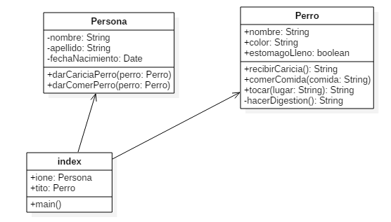

10. UML Ione y su perro.

Y esta sería una implementación PHP del diagrama anterior:

Perro.php

````php
<?php class Perro {
    private $_color;
    private $_nombre;
    private $_estomagoLleno = false; 
    public function __construct($nombre, $color) 
    { 
        $this->_nombre = $nombre; 
        $this->_color = $color; 
    } 
    public function recibirCariciaCabeza() 
    { 
        return $this->moverLaCola(); 
    }
    public function moverLaCola() 
    { 
        return 'estoy moviendo la cola!'; 
    }
    public function comer() { 
        $this->_estomagoLleno = true;
        sleep(5);
        return $this->_hacerDigestion();
    }
    public function hacerNecesidades() {
         return 'hago caca!';
    }
    private function _hacerDigestion() {
        $retorno = null;
        if ($this->_estomagoLleno)
        {
            $this->_estomagoLleno = false;
            $retorno = $this->hacerNecesidades();
        }
        return $retorno;
    }
}

````

Persona.php

```php
<?php 
class Persona { 
    private $_edad;
    private $_nombre;
    public function __construct($nombre, $edad) 
    { 
        $this->_nombre = $nombre; $this->_edad = $edad;
    }
    public function darCariciaPerro($perro) {
         echo $perro->recibirCariciaCabeza() . '<br>';
    }
    public function darDeComerPerro($perro)
    { 
        echo $perro->comer() . '<br>';
    }
}
```

index.php

````php
<!DOCTYPE html>
<html>
    <head>
    <meta http-equiv="Content-Type" content="text/html; charset=UTF-8">
    <title>Ejercicio 1: Clase Persona y Perro</title>
        <meta name="Author" content="Egizu, I. at ITC Cuatrovientos">
    </head>
    <body>
    <?php
  require_once 'Persona.php';
  require_once 'Perro.php';
        $persona = new Persona('Ione', 5);
        $perro = new Perro('Zaunk', 'blanco y negro');
        $persona->darCariciaPerro($perro);
        $persona->darDeComerPerro($perro);
    ?>
    </body>
</html>
````

En el ejemplo anterior, desde el *index.php* hacemos lo siguiente:

-   Creamos una persona con nombre *Ione* y 5 años.

-   Creamos un perro con nombre *Indeseable* y de color blanco y negro.

-   A continuación, invocamos dos métodos de Persona, que a su vez harán
    llamadas a métodos de la clase Perro y generarán una salida en el
    HTML.

###### Ejercicio 2

Partiendo del problema anterior se van a agregar los siguientes
requisitos:

\"**Ione**, además de tener un perro e interactuar como vimos, **va a la
escuela \' junto a 5 niños más'**. Uno de esos niños es hermana de
**Ione** y se llama Fulgencia (3 años), lo fundamental es que ambos son
dueños del mismo perro. Tienen un amigo que se llama Macaco (6 años) y
él es dueño de un gato de muy mal carácter, que, si le tiran de la cola,
¡araña y monta un buen cristo!\"

Pasos que hay que seguir:

-   Primero - Representar las relaciones entre las clases Index, Persona
    y Perro.

-   Segundo - Representar la Escuela, que debe poder contener a todos
    los niños de la letra.

    -   Representar la relación de \"hermano\" entre Ione -- Fulgencia.

    -   Representar el Gato.

    -   Usar toString() para que cada objeto sepa cómo convertirse a
        \"cadena de texto\".

Se espera que el Index esté representado en los diagramas y ser la
*\"Clase Controladora\"* que inicia el sistema), y **ninguna clase puede
imprimir por su cuenta (hacer un "echo"), solo Index (todos los métodos
deben retornar datos hacer ningún tipo de impresión).**

**Algunas consideraciones: **

El toString es un método reservado \_\_toString: PHP5 fija para varios
métodos especiales (constructor, destructor, toString, etc) una sintaxis
distinta, le agrega "\_\_" (dos guiones inferiores) al principio del
método. Por lo tanto, para que toString funcione hay que implementarlo
así, de lo contrario no funcionará al hacer echo \$persona;

**Propuesta de diseño UML**

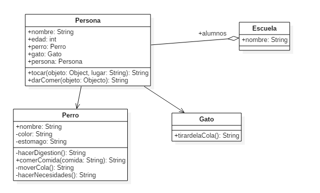

11. UML Ione, su perro y la escuela.

Index.php

`````php
<?php 
    require_once 'Persona.php';
    require_once 'Perro.php';
    require_once 'Gato.php'; 
    require_once 'Escuela.php'; 
    /* Ione tiene un perro */ 
    $persona = new Persona('I0ne', 5); 
    $perro = new Perro('Zaunk', 'negro y blanco'); 
    $persona->setPerro($perro); 
    /* Fulgencia, dueño del mismo perro... */ 
    $persona1 = new Persona('Fulgencia', 3); 
    $persona1->setPerro($perro); 
    /* ... y hermana de Ione */ 
    $persona->setHermano($persona1); 
    /* Macaco es dueño de un gato */ 
    $persona2 = new Persona('Macaco', 6); 
    $persona2->setGato(new Gato()); 
    /* Escuela Cuatrovientos */ 
    $escuela = new Escuela('Cuatrovientos'); 
    /* ... Ione va junto con 5 niños más ... */

    $escuela->addAlumno($persona); 
    $escuela->addAlumno($persona1); 
    $escuela->addAlumno($persona2);
    $escuela->addAlumno(new Persona('Julio',5)); 
    $escuela->addAlumno(new Persona('Martín',4));
    $escuela->addAlumno(new Persona('Carla',4));


`````

Escuela.php

`````php
<?php 
class Escuela { 
    private $_nombre; 
    private $_alumnos = array(); 
    public function __construct($nombre) 
    { 
        $this->_nombre = $nombre;
    } 
    public function addAlumno(Persona $persona) 
    { 
        $this->_alumnos[] = $persona; 
    }
    public function __toString() 
    { 
        $retorno = ''; 
        foreach ($this->_alumnos as $alumno) 
        { 
            $retorno .= $alumno .' '; 
            /*
            * Es lo mismo que decir
            * * 
                $retorno .= $alumno->__toString() .' ';
            * * 
            solo que el objeto sabe cómo convertirse en * String,
            tema que detecta cuando se hace * una operación de suma de cadenas * con el punto ".".
             */
        }
        return $retorno;
    }
}
`````

###### Ejercicio 3

Crea las clases Animal, Mamifero, Ave, Gato, Perro, Canario, Pinguino y
Lagarto. Crea, al menos, tres métodos específicos de cada clase y
redefine el/los método/s cuando sea necesario. Prueba las clases en un
programa en el que se instancien objetos y se les apliquen métodos.
Puedes aprovechar las capacidades que proporciona HTML y CSS para
incluir imágenes, sonidos, animaciones, etc. para representar acciones
de objetos; por ejemplo, si el canario canta, el perro ladra, o el ave
vuela.

###### Ejercicio 4

Crea la clase Vehiculo, así como las clases Bicicleta y Coche como
subclases de la primera. Para la clase Vehiculo, crea los métodos de
clase getVehiculosCreados() y getKmTotales(); así como el método de
instancia getKmRecorridos(). Crea también algún método específico para
cada una de las subclases. Prueba las clases creadas mediante una
aplicación que realice, al menos, las siguientes acciones:

-   Anda con la bicicleta

-   Haz el caballito con la bicicleta

-   Anda con el coche

-   Quema rueda con el coche

-   Ver kilometraje de la bicicleta

-   Ver kilometraje del coche

-   Ver kilometraje total

PHP -- Base de Datos
====================

MySQL 
------

**MySQL** es un sistema de gestión de bases de datos relacional
desarrollado bajo licencia dual GPL/Licencia comercial por Oracle
Corporation y está considerada como la base datos open source más
popular del mundo, y una de las más populares en general junto a Oracle
y Microsoft SQL Server, sobre todo para entornos de desarrollo web.

MySQL fue inicialmente desarrollado por MySQL AB (empresa fundada por
David Axmark, Allan Larsson y Michael Widenius). MySQL A.B. fue
adquirida por Sun Microsystems en 2008, y ésta a su vez fue comprada por
Oracle Corporation en 2010, la cual ya era dueña desde 2005 de [Innobase
Oy](https://es.wikipedia.org/w/index.php?title=Innobase_Oy&action=edit&redlink=1),
empresa finlandesa desarrolladora del motor
[InnoDB](https://es.wikipedia.org/wiki/InnoDB) para MySQL.

Al contrario de proyectos como Apache, donde el software es desarrollado
por una comunidad pública y los derechos de autor del código están en
poder del autor individual, MySQL es patrocinado por una empresa
privada, que posee el copyright de la mayor parte del código.

MySQL es usado por muchos sitios web grandes y populares, como
Wikipedia, Google(aunque no para búsquedas),
[Facebook](https://es.wikipedia.org/wiki/Facebook),
[Twitter](https://es.wikipedia.org/wiki/Twitter),
[Flickr](https://es.wikipedia.org/wiki/Flickr), ​ y
[YouTube](https://es.wikipedia.org/wiki/YouTube). ​

(Wikipedia)


19. MySQL y phpMyAdmin.

PhpMyAdmin
----------

### ¿Qué es PhpMyAdmin? 

**phpMyAdmin** es una herramienta escrita en
[PHP](https://es.wikipedia.org/wiki/PHP) con la intención de manejar la
administración de [MySQL](https://es.wikipedia.org/wiki/MySQL) a través
de páginas web, utilizando
[Internet](https://es.wikipedia.org/wiki/Internet). Actualmente puede
crear y eliminar [Bases de
Datos](https://es.wikipedia.org/wiki/Bases_de_Datos), crear, eliminar y
alterar
[tablas](https://es.wikipedia.org/wiki/Tabla_%28base_de_datos%29),
borrar, editar y añadir
[campos](https://es.wikipedia.org/wiki/Campo_%28base_de_datos%29),
ejecutar cualquier sentencia [SQL](https://es.wikipedia.org/wiki/SQL),
administrar claves en campos, administrar privilegios, exportar datos en
varios formatos y está disponible en 72 idiomas. Para poder acceder a la
base de datos, crear tablas y modificar los datos, entre otras cosas, es
necesario disponer de un software de gestión de la base de datos. Uno de
los más comunes es phpMyAdmin, una aplicación web que permite un control
total sobre bases de datos MySQL. Prácticamente en la totalidad de los
servidores con servicio de alojamiento con PYP y MySQL. El proveedor nos
facilitará, ya instalado. El software phpMyAdmin. Se encuentra
disponible bajo la licencia [GPL Versión
2](https://es.wikipedia.org/wiki/Licencia_p%C3%BAblica_general_de_GNU).

(Wikipedia)

### Acceder a phpMyAdmin desde Xampp

Para acceder al portal de phpMyAdmin debemos tener arrancado MySQL sin
errores. Pulsamos sobre el botón de configuración y nos lleva
directamente al portal para la gestión de la base de datos.

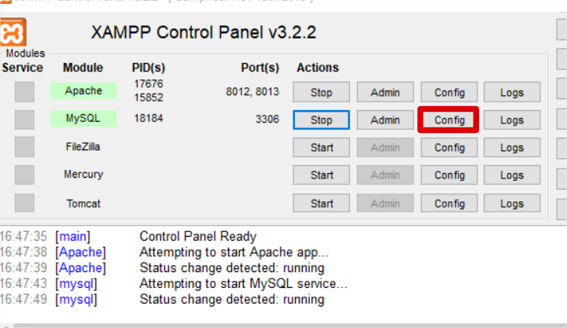

20. XAMPP panel de control.

### Crear base de datos

Lo primero es crear una base de datos, a la cual le establecemos
codificación únicode para poder almacenar caracteres especiales.

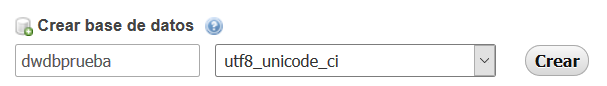

21. Crear base de datos.

Una vez seleccionada la base de datos podremos crear una nueva tabla o
seleccionar una tabla existente.

### Crear una tabla

Las tablas son la estructura donde se almacenan los datos. Los campos o
columnas de la tabla representan distintas categorías de información,
mientras que los registro s o filas de la tabla representa los alore de
los campos definidos.

Para aprender el manejo de phpMyAdmin, vamos a generar una primera tabla
con la siguiente estructura.

-   Nombre de la tabla: Usuarios

-   Campos: id, login, nombre, apellidos, email, edad, fecha\_alta.

Para crear una tabla tenemos que indicar el nombre de la tabla y el
número de campos que tendrá inicialmente. Podemos crear una tabla
mediante la interfaz de phpMyAdmin, sin necesidad de conocer la consulta
correspondiente.

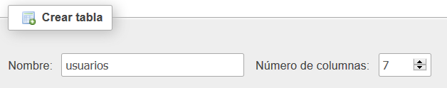

22. Crear tabla de usuarios.

A continuación, habrá que completar las características de cada uno de
los campos.

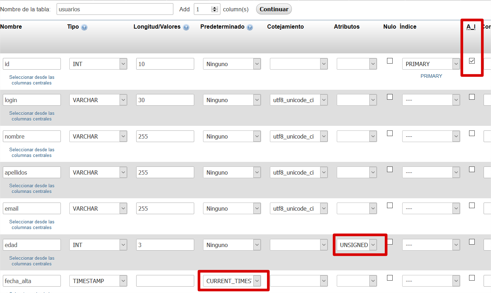

23. Agregar columnas a la tabla de base de datos.

Para insertar un registro utilizaremos la pestaña Insertar. Basta con
escribir el contenido de cada campo y guardar los datos.

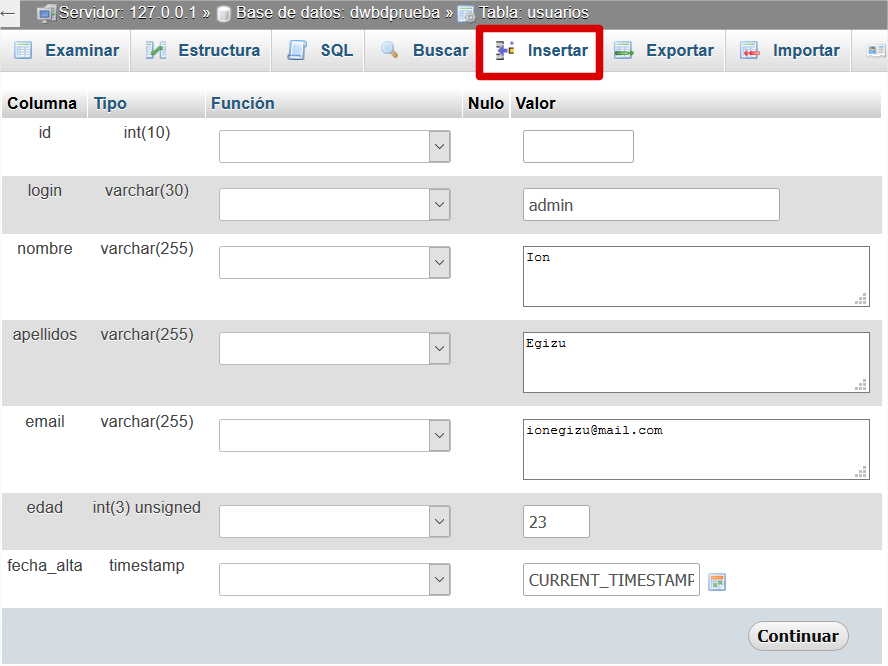

24. Insertar registros.

Tanto dese la pestaña Examinar como desde Buscar es posible navegar por
los datos de la tabla.

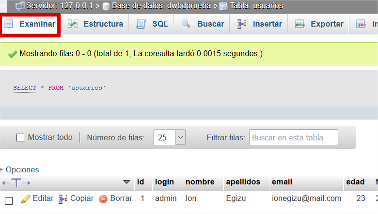

25. Examinar registros.

Además, tenemos la opción de lanzar consultas SQL desde la pestaña
correspondiente.

Controladores de MySQL para PHP
===============================

Desde una página con código escrito en PHP nos podemos conectar a una
base de datos y ejecutar comandos en lenguaje SQL - para hacer
consultas, insertar o modificar registros, crear tablas, dar permisos,
etc.

PHP puede trabajar con la práctica totalidad de gestores de bases de
datos que hay disponibles, tanto comercial como de código abierto.

Elegir una API
--------------

Dependiendo de la base de datos con la que vayamos a trabajar podemos
selecionar una API. El api de mysqli es más compleja y difícil de
aprender, pero también más potente si nuestra opción es utilizar una
base de datos de MySQL. PDO por el contrario, tiene la ventaja de que
pude utilizarse con otras bases de datos que no sean MySQl.

A continuación, se muestra unos ejemplos de código para crea una
conexión al servidor de MySQL que se está ejecutando en \"ejemplo.com\"
con el nombre de usuario \"usuario\" y la contraseña \"contraseña\".
También se ejecuta una consulta para saludar al usuario.

### Comparación de las APIs de MySQL

````php
<?php
// mysqli
$mysqli = new mysqli("ejemplo.com", "usuario", "contraseña", "basedatos");
$resultado = $mysqli->query("SELECT '¡Hola, querido usuario de MySQL!' AS _message FROM DUAL");
$fila = $resultado->fetch_assoc();
echo htmlentities($fila['_message']);
	// PDO
$pdo = new PDO('mysql:host=ejemplo.com;dbname=basedatos', 'usuario', 'contraseña');
$sentencia = $pdo->query("SELECT '¡Hola, querido usuario de MySQL!' AS _message FROM DUAL");
$fila = $sentencia->fetch(PDO::FETCH_ASSOC);
echo htmlentities($fila['_message']);
?>


````

### Ejemplos básicos de la extensión MySQLi [ ]](http://php.net/manual/es/mysqli.examples-basic.php#mysqli.examples-basic)

#### Realizar la gestión de la conexión

Conectarnos a la base de datos de MySQL llamada dwdbprueba.

-   Nombre de host: 127.0.0.1,

-   nombre de usuario: tu\_usuario,

-   contraseña: tu\_contraseña,

-   bd: dwdbprueba

````php
$mysqli = new mysqli('127.0.0.1', 'root, '', 'dwdbprueba');

// ¡Oh, no! Existe un error 'connect_errno', fallando la conexión
if ($mysqli->connect_errno) {
    	// La conexión falló.
// Mostramos mensaje al usuario
    	echo "Lo sentimos, este sitio web está experimentando problemas.";
// No se debe revelar información delicada
// de todas formas, la información de errores se podría registrar
echo "Error: Fallo al conectarse a MySQL debido a: \n";
echo "Errno: " . $mysqli->connect_errno . "\n";
echo "Error: " . $mysqli->connect_error . "\n";
    	// salimos
    	exit;
}

````

#### Realizar una consulta SQL

Para realizar la consulta del siguiente ejemplo suponemos que hemos
obtenido una variable para la identificación de un registro de la tabla
de base de datos. Así, lo que se muestra en este ejemplo es obtener
valores de la tabla usuarios a partir de un identificador primario.

````php
$sql = "SELECT id, nombre, apellidos FROM usuarios WHERE id = $uid";
if (!$resultado = $mysqli->query($sql)) {
    	// ¡Oh, no! La consulta falló. 
    	echo "Lo sentimos, este sitio web está experimentando problemas.";
    	// Mostramos la información del error.
//No hacer esto en un sitio público
echo "Error: La ejecución de la consulta falló debido a: \n";
echo "Query: " . $sql . "\n";
echo "Errno: " . $mysqli->errno . "\n";
echo "Error: " . $mysqli->error . "\n";
exit;
}
// ¿tenemos un resultado?
if ($resultado->num_rows === 0) {
    // ¡Oh, no ha filas! Unas veces es lo previsto, pero otras
    // no. Nosotros decidimos. En este caso, ¿podría haber sido
    // usuario_id demasiado grande? 
    echo "Lo sentimos. No se pudo encontrar una coincidencia para el ID $uid. Inténtelo de nuevo.";
    exit;
}
// Ahora, sabemos que existe solamente un único resultado en este ejemplo, por lo
// que vamos a colocarlo en un array asociativo donde las claves del mismo son los
// nombres de las columnas de la tabla
$usuario = $resultado->fetch_assoc();
echo "A veces veo a " . $usuario['nombre'] . " " . $usuario['apellidos'] . " en la TV.";
// Ahora, vamos a obtener cinco usuarios aleatorios y a imprimir sus nombres en una lista.
// El manejo de errores va a ser menor aquí, aunque ya sabemos cómo hacerlo
$sql = "SELECT id, nombre, apellidos FROM usuarios ORDER BY rand() LIMIT 5";
if (!$resultado = $mysqli->query($sql)) {
    echo "Lo sentimos, este sitio web está experimentando problemas.";
    exit;
}
// Imprimir nuestros cinco usuarios aleatorios en una lista, y enlazar cada uno
echo "<ul>\n";
while ($usuario = $resultado->fetch_assoc()) {
    echo "<li><a href='" . $_SERVER['SCRIPT_FILENAME'] . "? id =" . $usuario['id'] . "'>\n";
    echo $usuario['nombre'] . ' ' . $usuario['apellidos'];
    echo "</a></li>\n";
}
echo "</ul>\n";
// El script automáticamente liberará el resultado y cerrará la conexión
// a MySQL cuando finalice, aunque aquí lo vamos a hacer nosotros mismos
$resultado->free();
$mysqli->close();
?>

````
#### Evitar ataques de SQL Injection a través de Prepared Statements

En ocasiones se suelen ver métodos que lanzan consultas a la base de
datos con la siguiente sintaxis:


````php
$query="SELECT * FROM usuarios WHERE nombreUsuario ='".$usuario."' AND contrasena ='".$contrasena."'";
````


Sin embargo, debe quedar claro que esto es una **MALÍSIMA PRÁCTICA DE
PROGRAMACIÓN**. Hasta ahora lo hemos hecho así en los ejemplos vistos
por motivos de simplicidad durante la primera fase de aprendizaje. No
obstante, ya es momento de abordar cómo se debería hacer para evitar
males mayores.

El riesgo que corre una aplicación en la que las consultas a la base de
datos reciban los parámetros como meras concatenaciones de texto son,
principalmente, ataques de *SQL Injection.* Te animo a que busques en
Internet información sobre esta técnica, pero básicamente consiste en
introducir una sentencia booleana que siempre se evalúa a true, para que
así la sentencia SQL que se esté ejecutando siempre se evalúe de manera
afirmativa.

<http://es.wikipedia.org/wiki/Inyecci%C3%B3n_SQL>

La manera más directa de atajar este peligro es utilizando Prepared
Statements. Este tipo de consultas tienen una sintaxis muy similar a las
hechas hasta ahora. Lo único que varía es la manera de pasarle los
parámetros. Veamos un ejemplo:

````php
<?php
$sql = "INSERT INTO usuarios (login, nombre, apellidos, email, edad) VALUES(?,?,?,?,?)";
$stmt = $mysqli->prepare($sql);
$stmt->bind_param('ssssi', $login, $nombre, $apellidos, $email, $edad); 
$stmt->execute();

````

Como puedes ver, ahora en el lugar del parámetro introducimos el
carácter '?'. En la siguiente instrucción, bind\_param está rellenando
el valor de estos parámetros. En el ejemplo anterior, concretamente,
está indicando que la consulta recibe dos cadenas (String, por eso dos
eses), y luego le pasa el valor de los dos parámetros en orden. Si en
lugar de Strings recibiese enteros, pondríamos una 'i' en lugar de una
's'.

Especificación del tipo de caracteres:

| **Carácter**   |  **Descripción**   | 
|---|---|
| i  |  La variable correspondiente es de tipo **entero**.  | 
|  d |  La variable correspondiente es de tipo **double**. | 
|  S | La variable correspondiente es de tipo **string**.   | 
| b  |  La variable correspondiente es un **blob** y se envía en paquetes.  | 
         

Ejercicios
----------

**Ejercicio 1**

Crea una aplicación web que permita hacer listado, alta, baja y
modificación sobre la tabla cliente de la base de datos banco.

-   Para realizar el listado bastará un SELECT, tal y como se ha visto
    en los ejemplos.

-   El alta se realizará mediante un formulario donde se especificarán
    todos los campos del nuevo registro. Luego esos datos se enviarán a
    una página que ejecutará INSERT.

-   Para realizar una baja, se mostrará un botón que ejecutará DELETE.

-   La modificación se realiza mediante UPDATE.

Desarrollo de Aplicaciones con PHP
==================================

En el desarrollo de aplicaciones, independientemente del lenguaje de
programación o plataforma que estemos empleando, es muy importante
diseñar una arquitectura a seguir. Esta arquitectura debe estar bien
definida y seguir principios del diseño de software para asegurar así
que nuestras aplicaciones serán escalables, fáciles de mantener y
fáciles de comprender.

Es muy habitual ver cómo los desarrolladores comienzan a realizar
aplicaciones sin un análisis previo suficiente. No obstante, el estilo
de programación en el que nos limitamos a escribir líneas de código
según se vayan necesitando realizar funcionalidades, sin tener muy en
cuenta dónde las estamos poniendo ni cómo, puede servir para cuando
estamos aprendiendo a programar, pero sin ninguna duda, es una práctica
que cuanto antes se abandone antes comenzaremos a escribir software de
más calidad.

Por ello, y aprovechando que estamos iniciando el aprendizaje de PHP,
éste parece un momento muy adecuado para ver cómo se podría estructurar
una aplicación mediante una arquitectura que persigue:

-   Dotar a la aplicación de un diseño limpio.

-   Mejorar la escalabilidad, permitiendo reemplazar una capa con un
    impacto mínimo sobre el resto.

-   Mejorar el mantenimiento por la razón anterior.

-   Poder exportarla a otras aplicaciones.

-   Ser una base sólida sobre la que iniciar nuevos desarrollos.

Veremos ahora, un ejemplo basado en la realidad de un programador. En
este caso, se trata de un **CRUD de usuarios** (acrónimo de Crear,
Obtener, Actualizar y Borrar (del original en inglés: **C**reate,
**R**ead, **U**pdate and **D**elete).

**Los componentes de nuestra aplicación deben ser transparentes en la
medida de lo posible al actual sistema de persistencia o fuente de
datos** para permitir migraciones entre distintos fabricantes, distintos
tipos de almacenamiento y diferentes fuentes de datos.

Arquitectura en 3 capas
-----------------------

La arquitectura en tres capas es un tipo de arquitectura usada en la
gran mayoría de sistemas. Se suele usar en sistemas que implementan un
modelo de negocio como podría ser una tienda online, una aplicación para
gestionar ciertos datos, etc.

Todo sistema que gestiona datos tendrá una base de datos para guardar
esos datos y una interfaz de usuario que será con la que interactúan los
usuarios. Además, una parte del sistema se encargará de procesar los
datos y gestionar lo que se hace con ellos. La arquitectura en tres
capas lo que hace es dividir el sistema en tres partes diferenciadas, de
tal forma que cada capa solo se comunique con la inferior. Esas tres
capas se denominan:

-   **Persistencia:** Esta capa se encarga de guardar los datos. Será
    donde se gestione todo lo relativo a la base de datos y a la
    creación, edición y borrado de datos de ésta.

-   **Negocio:** En esta capa se gestiona la lógica de la aplicación. Es
    donde se dice que se hace con los datos. Por ejemplo, para una
    aplicación de gestión de una biblioteca será donde se gestione
    cuántos préstamos puede tener un usuario, que ocurre si un usuario
    se retrasa al devolver un libro, etc. Estará conectada con la capa
    de persistencia para poder realizar sus funciones.

-   **Presentación:** En esta capa se crea la interfaz del usuario. Su
    única función es pasarle las acciones que realice el usuario a la
    capa de negocio.

Al hacer que cada capa se comunique solo con la inmediatamente inferior,
conseguimos que si hay que realizar un cambio no nos volvamos locos
tocando todo el sistema. Si por ejemplo tenemos que cambiar la forma en
la que se guardan los datos (el tipo de base de datos, por ejemplo),
solo tendríamos que tocar la capa de persistencia.

(Gomez, V., 2015 *Arquitectura en tres capas.*

Recuperado de:
[https://instintobinario.com](https://instintobinario.com))

Además de estas 3 capas, esta arquitectura hace uso de alguna otra para
asumir otras responsabilidades.

Por ejemplo:

-   **Utilidad:** suele ser útil para agrupar funcionalidades que no son
    específicas de los objetos de nuestra aplicación, y que podrían ser
    utilizadas por otras aplicaciones.

-   **Servicios:** en caso de que necesitemos poner mucho codigo en los
    controladores, puede ser interesante que los controladores utilicen
    servicios para distribuir responsabilidades.

Por último, también deberíamos disponer de carpetas para alojar otro
tipo de recursos como:

-   **Recursos estáticos:** carpeta para almacenar ficheros estáticos
    como imágenes, css, js, etc.

-   **Configuración:** para archivos de propiedades y con información de
    configuración. Un ejemplo puede ser los parámetros de conexión a la
    base de datos.

-   **Bibliotecas:** para todas aquellas bibliotecas externas que
    nuestra aplicación necesite. Esto no incluye bibliotecas javascript.
    Estas últimas deberían ir en el directorio destinado a ficheros js.

### Persistencia

Lo primero es crear una carpeta que se llame \\persistence, y dentro
crearemos otras dos carpetas, una \\conf y otra \\DAO.

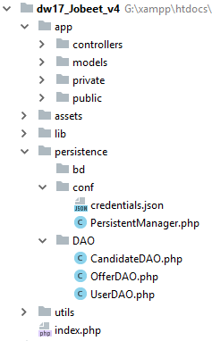

12. Persistencia: Arquitectura de aplicación en 3 capas.

#### Crear una conexión a base de datos

Dentro de la carpeta \\conf se establece el código necesario para
realizar la conexión con base de datos.

###### PersistentManager

````php
<?php

class PersistentManager {
 
 // Instancia privada de conexión.
  private static $instance = null;

  //Conexión a BD
  private static $connection = null;

  //Parámetros de conexión a la BD.
  private $userBD = "";
  private $psswdBD = "";
  private $nameBD = "";
  private $hostBD = "";

  //Get de la conexión – SINGLETON - 
  public static function getInstance() {
    if (!self::$instance instanceof self) {
      self::$instance = new self;
    }
    return self::$instance;
  }
  //Constructor de la clase privado: solo queremos construir una instancia
  //Se encarga de establecer una conexion con nuestro GBBDD.
  private function __construct() {
    $this->establishCredentials();
    PersistentManager::$connection = mysqli_connect($this->hostBD,
      $this->userBD, $this->psswdBD, $this->nameBD)
    or die("Could not connect to db: " . mysqli_error());
    mysqli_query(PersistentManager::$connection, "SET NAMES 'utf8'");
  }
     // Lectura de parámetros de configuración desde archivo externo
  private function establishCredentials() {
	  $dir = __DIR__;
        if (file_exists($dir.'\..\..\etc\conf\credentials.json')) {
            $credentialsJSON = file_get_contents($dir.'\..\..\etc\conf\credentials.json');
            $credentials = json_decode($credentialsJSON, true);

            $this->userBD = $credentials["user"];
            $this->psswdBD = $credentials["password"];
            $this->nameBD = $credentials["name"];
            $this->hostBD = $credentials["host"];
        }
  }
  //Cierra la conexión.
  public function close_connection() {
        mysqli_close();
  }
}
````

Dado que solo debería existir una instancia de la conexión en el
proyecto, esta clase no se entiende como una factoría de objetos, *¿qué
solución se te ocurre para asegurarnos de que esto sucede así y nos
evitamos efectos colaterales?*

#### Patrón de diseño Singleton

Su intención consiste en garantizar que una clase sólo tenga una
instancia y proporcionar un punto de acceso global a ella.

El patrón *singleton* se implementa creando en nuestra clase un método
que construye una instancia del objeto sólo si todavía no existe alguna.
Para asegurar que la clase no puede ser instanciada nuevamente se regula
el alcance del constructor (con atributos como protegido o privado).
````php
  //Get de la conexión – SINGLETON - 
  public static function getInstance() {
    if (!self::$instance instanceof self) {
      self::$instance = new self;
    }
    return self::$instance;
  }
````

#### Modelo Usuario de Base de Datos

El patrón de diseño DAO usa un Objeto de Acceso a Datos para abstraer y
encapsular el acceso a los datos. Un DAO maneja la conexión con la
fuente de datos para obtener y guardar los datos. De esta forma, sirve
de interfaz común entra la aplicación y los mecanismos de almacenamiento
a datos utilizados (por ejemplo, una base de datos).

Los Objetos de Acceso a Datos son un Patrón de Diseño muy conocido en
muchas tecnologías (*tales como en PHP, J2EE, .NET, etc)* y considerados
una **buena práctica**. La ventaja de usar objetos de acceso a datos es
que cualquier objeto de negocio (aquel que contiene detalles específicos
de operación o aplicación) no requiere conocimiento directo del destino
final de la información que manipula.

Normalmente se crea un DAO por cada Objeto que usemos en nuestra
aplicación. Por ejemplo, si tuviésemos una aplicación que llevase a cabo
tareas con Usuarios, Productos y Facturas, podríamos plantear un DAO
para cada uno de ellos, que reuniese todas las operaciones CRUD a
realizar sobre BD.

En realidad, la norma general es realizar un *GenericDAO* templatizado,
que pueda recibir cualquier objeto, y realice dichas operaciones que son
comunes a todos los objetos. Si es necesario añadir operaciones
concretas sobre alguno de ellos, entonces se crea un DAO específico por
objeto y se hace que herede del *GenericDAO* padre.

###### GenericDAO

````php
<?php
abstract class GenericDAO {

  //Conexión a BD
  protected $conn = null;
  //Constructor de la clase
  public function __construct() {
    $this->conn = PersistentManager::getInstance()->get_connection();
  }

  // métodos abstractos para CRUD de clases que hereden
  abstract protected function insert($email, $password);
  abstract protected function selectAll();
  abstract protected function selectById($id);
  abstract protected function update($id, $email, $password);
  abstract protected function delete($id);
}

````

###### UserDAO

````php
<?php

class UserDAO extends GenericDAO {

    //Se define una constante con el nombre de la tabla
    const USER_TABLE = 'users';

    public function selectAll() {
        $query = "SELECT * FROM " . UserDAO::USER_TABLE;
        $result = mysqli_query($this->conn, $query);
        $users= array();
        while ($userBD = mysqli_fetch_array($result)) {
            $user = array(
   				'id' => $userBD["id"],
 				'email' => $userBD["email"],
 				'password' => $userBD["password"],
 		);  
            array_push($users, $user);
        }
        return $users;
    }

    public function insert($email, $password) {
        $query = "INSERT INTO " . UserDAO::USER_TABLE .
                " (email, password) VALUES(?,?)";
        $stmt = mysqli_prepare($this->conn, $query);       
        mysqli_stmt_bind_param($stmt, 'ss', $email, $password);
        return $stmt->execute();
    }

     public function checkExists($email, $password) {
        $query = "SELECT email, password FROM " . UserDAO::USER_TABLE . " WHERE email=? AND password=?";
        $stmt = mysqli_prepare($this->conn, $query);
        mysqli_stmt_bind_param($stmt, 'ss', $email, $password);
        if(mysqli_stmt_execute($stmt)>0)         
            return true;
        else
            return false;
    }
    
    
    public function selectById($id) {
        $query = "SELECT email, password FROM " . UserDAO::USER_TABLE . " WHERE idUser=?";
        $stmt = mysqli_prepare($this->conn, $query);
        mysqli_stmt_bind_param($stmt, 'i', $id);
        mysqli_stmt_execute($stmt);
        mysqli_stmt_bind_result($stmt, $email, $password);

        while (mysqli_stmt_fetch($stmt)) {
            $user = array(
   				'id' => $id,
 				'email' => $email,
 				'password' => $password
 		);
       }

        return $user;
    }

    public function update($id, $email, $password) {
        $query = "UPDATE " . UserDAO::USER_TABLE .
                " SET email=?, password=?"
                . " WHERE idUser=?";
        $stmt = mysqli_prepare($this->conn, $query);
        mysqli_stmt_bind_param($stmt, 'sssi', $email, $password, $id);
        return $stmt->execute();
    }
    
    public function delete($id) {
        $query = "DELETE FROM " . UserDAO::USER_TABLE . " WHERE idUser =?";
        $stmt = mysqli_prepare($this->conn, $query);
        mysqli_stmt_bind_param($stmt, 'i', $id);
        return $stmt->execute();
    }
}
?>
````


Modelo-Vista-Controlador
------------------------

Si está acostumbrado a desarrollar sitios web PHP sin un framework,
probablemente utilice el paradigma de un archivo PHP por página HTML.
Estos archivos PHP probablemente contienen el mismo tipo de estructura:
inicialización y configuración global, lógica de negocio relacionada con
la página solicitada, recuperación de registros de bases de datos y,
finalmente, código HTML que construye la página.

Puedes utilizar un motor de plantilla para separar la lógica del HTML.
Tal vez utilices una capa de abstracción de base de datos para separar
la interacción del modelo de la lógica empresarial.

Pero la mayor parte del tiempo, acabas terminando con un montón de
código que es una pesadilla para mantener. Fue rápido de construir, pero
con el tiempo, es cada vez más difícil hacer cambios, especialmente
porque nadie excepto tu entiende cómo se construye y cómo funciona.

Como con todos los problemas, hay buenas soluciones. Para el desarrollo
web, la solución más común para organizar el código hoy en día es el
patrón de diseño MVC.

(El tutorial de Jobeet, 2018).

Modelo Vista Controlador (MVC) es un patrón o modelo de abstracción de
desarrollo de software que separa los datos de una aplicación, la
interfaz de usuario, y la lógica de negocio en tres componentes
distintos. Los componentes son:

-   **Modelo**: Esta es la representación específica de la información
    con la cual el sistema opera. Así, suele estar compuesta por las
    clases que representan los objetos con los que trabaja la
    aplicación.

-   **Vista:** presenta el modelo en un formato adecuado para
    interactuar, usualmente la interfaz de usuario.

-   **Controlador:** responde a eventos, usualmente acciones del
    usuario, e invoca peticiones al modelo y, probablemente, a la vista.

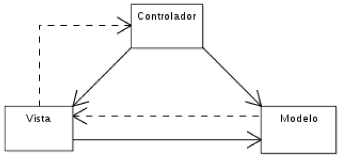

13. Patrón MVC

### ¿Cómo funciona el patrón MVC?

El funcionamiento básico del patrón MVC, puede resumirse en:

-   El usuario realiza una petición

<!-- -->

-   El controlador captura el evento (puede hacerlo mediante un
    manejador de eventos -- *handler* -, por ejemplo). Hace la llamada
    al modelo/modelos correspondientes (por ejemplo, mediante una
    llamada de retorno -- *callback -*) efectuando las modificaciones
    pertinentes sobre el modelo

-   El modelo será el encargado de interactuar con la base de datos, ya
    sea en forma directa, con una capa de abstracción para ello, un Web
    Service, etc. Y retornará esta información al controlador

El controlador recibe la información y la envía a la vista

-   La vista, procesa esta información pudiendo hacerlo desde el enfoque
    que veremos en este libro, creando una capa de abstracción para la
    lógica (quien se encargará de procesar los datos) y otra para el
    diseño de la interfaz gráfica o GUI.

La lógica de la vista, una vez procesados los datos, los "acomodará" en
base al diseño de la GUI - *layout* -- y los entregará al usuario de
forma "humanamente legible".

La manera de implementar esta arquitectura no es única. En este ejemplo
se muestra una de las muchas aproximaciones posibles, pero podrás
encontrar implementaciones diferentes en otros manuales.


14. Diagrama UML de la Estructura de componentes.

Esto traducido a carpetas, nos dejaría una estructura de proyecto como
la que sigue:

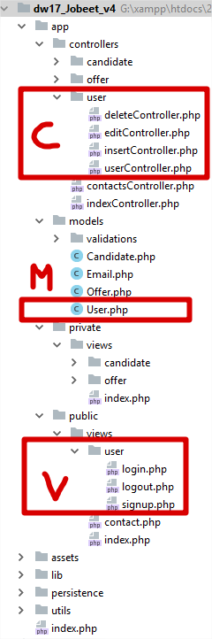

15. Ejemplo de la aplicación de MVC en una aplicación.

Diferencias entre arquitectura en 3 capas y Modelo-Vista-Controlador
--------------------------------------------------------------------

A primera vista, la arquitectura a tres niveles puede parecer similar al
concepto de controlador de vista modelo (MVC); sin embargo,
topológicamente son diferentes. Una regla fundamental en una
arquitectura de tres niveles es que el nivel del cliente nunca se
comunica directamente con el nivel de datos; en un modelo de tres
niveles toda la comunicación debe pasar a través del nivel medio.
Conceptualmente la arquitectura de tres niveles es lineal. Sin embargo,
la arquitectura MVC\[model-view-controller\] es triangular: la vista
envía actualizaciones al controlador, el controlador actualiza el modelo
y la vista se actualiza directamente desde el modelo.

(Wikipedia, Recuperado de:
<http://en.wikipedia.org/wiki/Multitier_architecture#Three-tier_architecture>)

### La Arquitectura MVC

-   **Modelos**: Estos representan \"cosas\" en tu aplicación. Esta capa
    se ha vuelto un poco borrosa en los últimos años.

-   **Vistas**: La interfaz de usuario. La cosa con la que el usuario
    interactúa.

-   **Controladores**: El código de programación que responde al usuario
    y a los cambios en la capa de modelo

### Arquitectura de 3 niveles

Con la arquitectura de 3 niveles, tiene capas con diferentes
responsabilidades.

-   **Servicios al usuario:** (o \"servicios\" en general) Esta capa
    trata más bien de coordinar la recuperación y las modificaciones de
    la capa \"modelo\". Aquí se realizan acciones complejas y de varios
    pasos

-   **Capa de Negocio:** Esto representa las reglas de negocio grabadas
    en el código de programación. Lo que \"El Negocio\" quiere se aplica
    en esta capa.

-   **Capa de acceso a datos:** Una o más clases responsables de acceder
    a un almacén de datos persistente.

La única parte de la arquitectura de 3 niveles que se cruza con MVC es
la \"capa de negocio\". Los \"Modelos\" en MVC y la \"Capa de Negocio\"
en la arquitectura de 3 niveles están tratando de lograr el mismo
objetivo.

La \"M\" de MVC se ha vuelto borrosa

La capa \"modelo\" en MVC se ha expandido en los últimos años. Por lo
que he visto, hay dos, posiblemente tres tipos de modelos:

-   **Modelos de Dominio:** Éstas representan las \"cosas\" que le
    importan a \"The Business\": el Dominio de Negocio. Estas clases
    contienen datos y todos los procedimientos que operan sobre ellos
    con el fin de hacer cumplir las reglas de negocio. Frecuentemente
    los Modelos de Dominio están ligados a tablas en una base de datos.
    Esto parece encajar en la \"capa de negocio\" de la arquitectura de
    3 niveles.

-   **Modelos de vistas**: Estas son clases utilizadas para masajear los
    datos de los modelos de dominio en algo más agradable a la vista.
    Esto no encaja en ninguna parte de la arquitectura de 3 niveles
    porque los modelos de vista no implementan la lógica de negocio, ni
    proporcionan ningún tipo de servicio o acceso a datos.

-   **Modelos de Negocio**: En aplicaciones complejas, surge la
    necesidad de desacoplar el Modelo de Dominio de la Lógica de
    Negocio. Los Modelos de Negocio contienen datos y procedimientos que
    operan sobre esos datos para implementar reglas de negocio, y los
    Modelos de Dominio son relegados a \"Bolsas de Propiedad\" \--
    objetos que sólo contienen datos, pero no contienen ningún
    comportamiento. Los Modelos de Dominio se convierten en otra forma
    de Objeto de Transferencia de Datos entre la base de datos y la
    aplicación.

En ninguna parte del MVC se menciona el acceso a los datos. En algunos
casos, verá que el acceso a los datos pertenece a la capa \"modelo\" de
MVC, que como hemos visto ya no es una capa de corte claro. Realmente
veo que la arquitectura de 3 niveles está siendo emparejada con MVC para
crear una aplicación completa. Una aumenta o mejora la otra:

**Modelos**

-   Modelos de dominio (MVC/3-tier)

-   Ver Modelos (MVC)

-   (opcionalmente) Modelos de Negocio (MVC/3-tier)

**Vistas (**MVC**)**

**Controladores (**MVC**)**

**Acceso a datos (**3-tier**)**

**Servicios (**3-tier**)**

Hay alguna intersección, pero están en gran medida separados, y juntos
se utilizan para desacoplar y aislar varios componentes de un sistema
más grande.

[Burghardt](https://softwareengineering.stackexchange.com/users/118878/greg-burghardt),
G. ,2015. Recuperado de:
<https://softwareengineering.stackexchange.com/questions/299836/difference-between-3-tier-architecture-and-mvc-model-view-controller-in-asp-n>

### Ejercicios

###### Ejercicio 1: MVC -- 4Vientos TripAdvisor

######## Descripción

Para la entrega crea una carpeta nombre\_apellido que contenga tanto el
proyecto como la BD.

Vamos a realizar una aplicación en PHP que consista en una **agencia de
viajes** y que realice una serie de operaciones contra los viajes
almacenados en la BD en MySQL.

########  Creación de base de datos

Crea una base de datos que se llame **travelAgency**. Establece la
Collation a utf8\_unicode\_ci.

Esta tendrá una tabla que se llamará trip, con los siguientes campos:

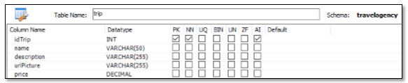

######## Carga el proyecto con la plantilla inicial

A continuación, abre el proyecto PHP llamado **simu4Viajes\_Init**. Este
ya viene estructurado y con una plantilla Bootstrap para listar toda la
información acerca de los viajes que manejará nuestra web.

La página de inicio será un listado de todos los viajes que incluye
nuestra agencia:

######## Listado

Por cada viaje mostraremos:

-   En una etiqueta \ la URL del viaje (urlPicture en la BD)

-   En una etiqueta \<h4\> el precio (price en la BD)

-   En una etiqueta \<h4\> el nombre (name en la BD). Este nombre, a su
    vez, irá dentro de una etiqueta enlace (\<a\>) que apuntará a la
    página del detalle.

-   Un botón para eliminar el viaje.

-   En una etiqueta \<p\> la descripción (description en la BD)

-   Un botón para mostrar más información acerca del viaje.


########  Crear un nuevo viaje

> En la parte superior izquierda existe un enlace que permitirá sugerir
> nuevos viajes.
>
> {width="1.5384612860892388in"
> height="0.7597922134733158in"}
>
> Y que, por tanto, te deberá dirigir a una página de inserción como
> esta:
>
> 

Una vez se realice la inserción, se redirigirá a la página del listado
inicial otra vez.

######## Eliminar viaje

El botón del "cubo de basura" permitirá el borrado del viaje de la BD.


######## Ver más...

El botón de Ver más... permitirá obtener un detalle de los campos del
viaje, mostrados en una pantalla como esta:


######## Modificar viaje

Desde la pantalla anterior del detalle, se podrán modificar los campos
del viaje que se ha cargado. Para ello puedes utilizar un botón en un
form que pase por POST el id oculto al action: edit.php, o bien puedes
realizar un enlace a edit.php pasándole el id por GET:

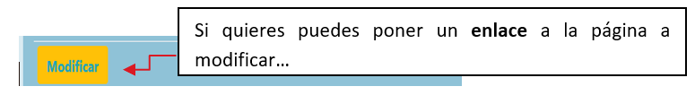

De manera que una vez pulsado el botón aparecerá un formulario como
este, con todos los datos del viaje específico cargados:

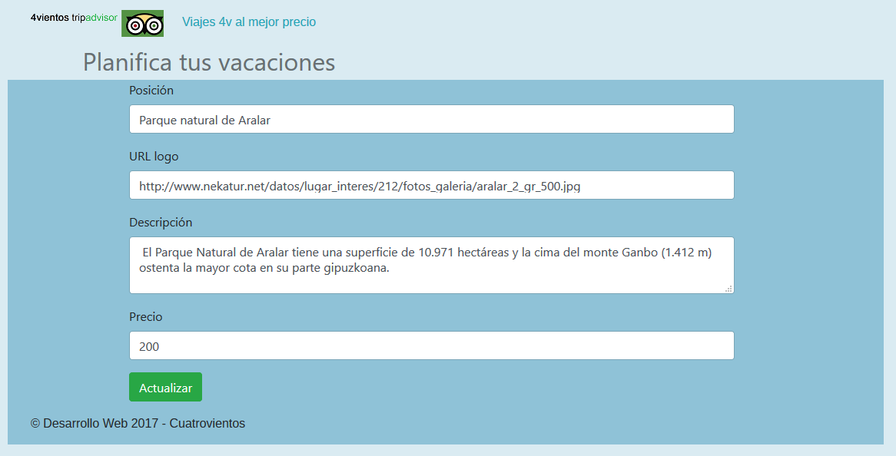

Una vez que se haya modificado se volverá a dirigir al usuario a la
página del listado inicial.

###### Ejercicio 2: MVC -- Editorial 4Vientos

######## Descripción

Para la entrega crea una carpeta **nombre\_apellido** que contenga tanto
el proyecto como la BD.

Vamos a realizar una aplicación en PHP que consista en una web de
búsqueda de libros de informática y que realice una serie de operaciones
contra los libros, almacenados en la BD de MySQL.

######## Creación de base de datos: BOOKS y USER

Crea una base de datos que se llame **editorial4bd**. Establece la
Collation a utf8\_unicode\_ci.

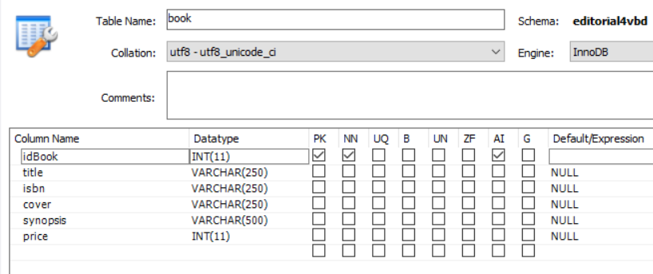

######## Carga el proyecto con la plantilla inicial

A continuación, abre el proyecto PHP llamado
**dw01Eval\_Editorial4V\_Init.** Este ya viene estructurado y con una
plantilla Bootstrap para listar toda la información acerca de los libros
de empleo que manejará nuestra web.

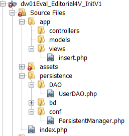

######## Listado

Al iniciar la web deben cargarse los libros almacenados en la base de
datos.

######## Crear un nuevo libro de informática

En la parte superior existe un enlace que permitirá sugerir nuevos
libros.


Y que, por tanto, te deberá dirigir a una página de inserción como esta.

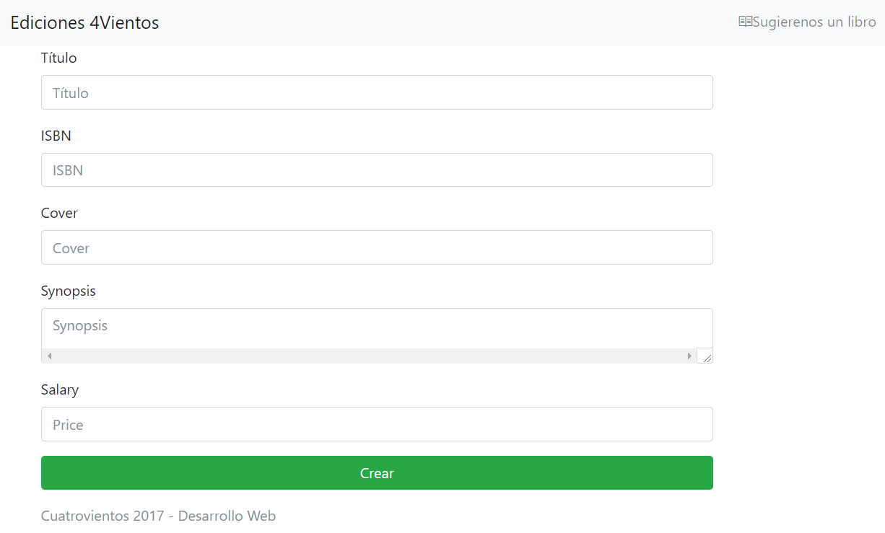

Una vez se realice la inserción, se redirigirá a la página del listado
inicial otra vez. Pero antes, se debe de visualizar un mensaje de
agradecimiento al usuario.

######## Eliminar libros de informática

El botón del "cubo de basura" permitirá el borrado de las ofertas de
empleo de la BD


########  Detalles

El enlace del nombre te permitirá obtener un detalle de los campos de la
receta, mostrados en una pantalla como esta:


######## Modificar un libro de infomática

Desde el botón de edición, se podrán modificar los campos de la oferta
de empleo. Para ello puedes utilizar un botón en un form que pase por
POST el id oculto al action: edit.php, o bien puedes realizar un enlace
a edit.php pasándole el id por GET:


De manera que una vez pulsado el botón aparecerá un formulario como
este, con todos los datos del viaje específico cargados:

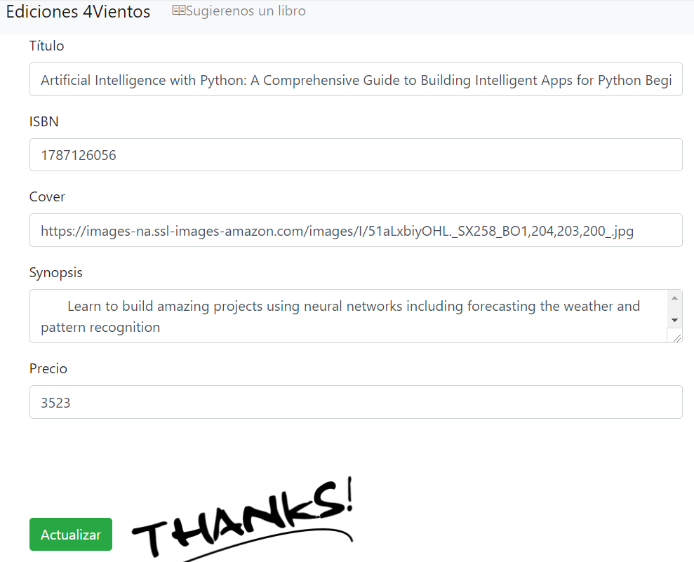

######## Buscar una oferta de empleo

Desde el formulario de búsqueda debemos permitir filtrar la
visualización de elementos en la página principal, independientemente
del campo en el que aparezca la palabra a buscar. Es decir, sea cual sea
el valor que buscar se deben obtener las coincidencias de este texto en
los campos de la tabla Book.

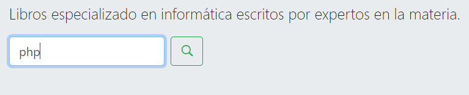

**NOTA:** El operador LIKE se utiliza en una cláusula WHERE para buscar
un patrón especificado en una columna.

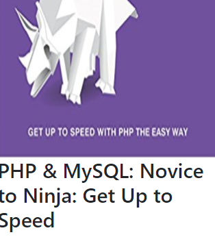

###### Ejercicio 2.1: GESTIÓN DE ACCESO: Autentificación VS Autorización

Nuestra web dispone de control de la autorización y autentificación de
usuarios. Dependiendo de los permisos concedidos los usuarios
interactúan de diferente manera sobre los elementos libros.

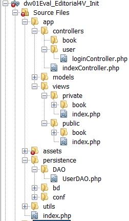

######## Nueva tabla de base de datos: USER

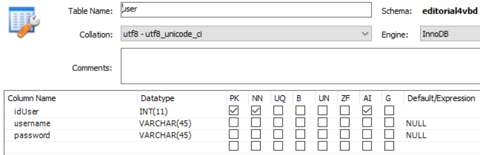

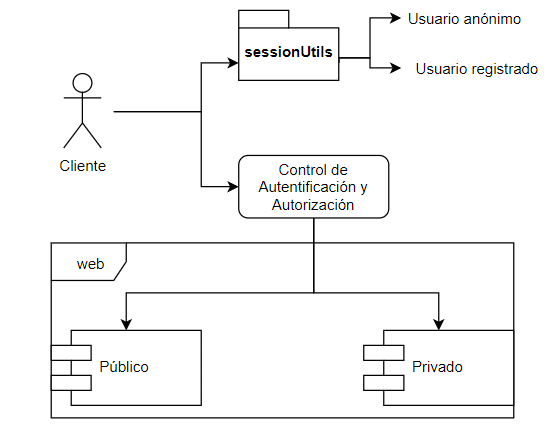

######## Control de acceso

Desde el **index.php** situado a nivel de *SourceFiles* se determina a
que módulo tiene acceso el usuario. Dependiendo de si tiene una sesión
activa o no accede al módulo **público** de la web o al módulo
**privado**.

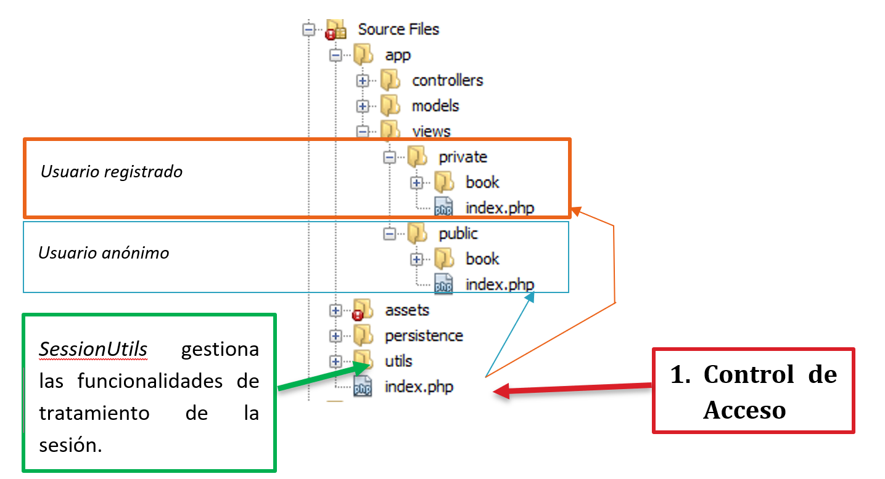

######## Tratamiento diferenciado de la gestión de libros

Las autorizaciones para la gestión de los libros son diferentes
dependiendo de en qué módulo nos encontremos.

**Desde el apartado público** solo tenemos acceso a un buscador. Una vez
realizada la consulta podemos acceder a los detalles del libro
encontrado.


**Desde el apartado privado** podemos
realizar todas las operaciones CRUD contra la tabla de libros. Se nos
muestran desde el inicio todos los libros disponibles y podemos editar
sus valores, borrar libros existentes o añadir nuevos libros.

######## Casos de uso

Cuando accede un **usuario anónimo** se encuentra con una pantalla vacía
donde únicamente puede lanzar consultas sobre el libro en cuestión. Una
vez que la base de datos ha retornado los libros, dependiendo de la
consulta, el usuario puede acceder a los detalles de cada uno de estos
libros.

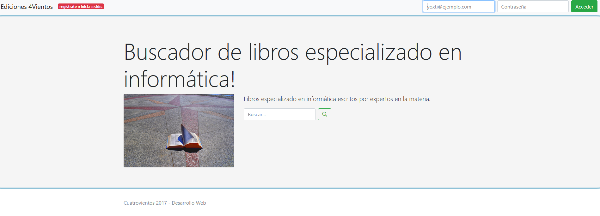

Al acceder un **usuario registrado**, aparece la opción de búsqueda,
pero por defecto la página muestra todos los libros de los que dispone
la base de datos. El usuario puede realizar acción de *edición o
borrado* situándose en cada uno de estos libros. Además, en la barra de
navegación tiene opción de *añadir nuevos libros*.

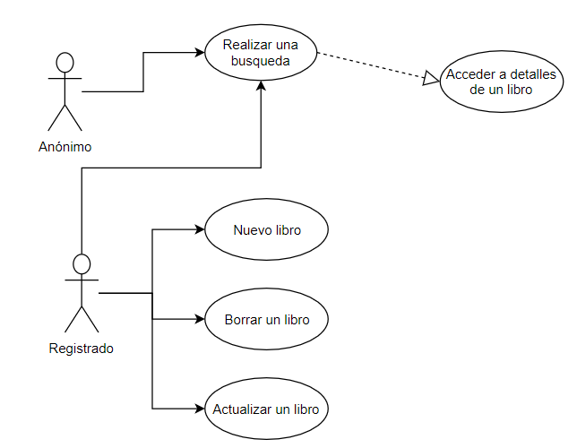

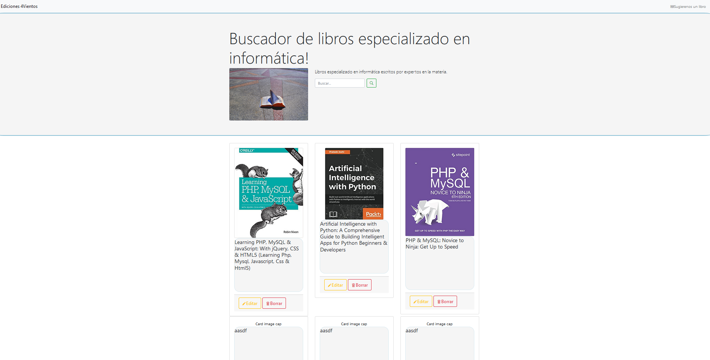

Google Auth.
------------

### Autentificación externa

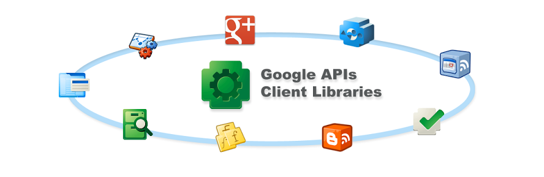

16. Google APIs Client Libraries

En este documento se muestran los pasos que permiten comenzar a utilizar
la plataforma de Google+ en pocos minutos como herramienta para la
administración del registro de usuarios en tu página web.

El objetivo es:

-   Uso del botón de inicio de sesión de Google+ para obtener un token
    de actualización de OAuth 2.0.

-   Intercambiando el token de actualización por un token de acceso.

-   Hacer solicitudes de API de Google+ con el token de acceso, incluida
    la obtención de una lista de las personas que el usuario ha marcado
    en un círculo.

-   Desconectar la aplicación de la cuenta de Google del usuario y
    revocar los tokens.

###  Habilitar Google+ API

El primer paso para poder hacer uso de la autorización vía Google+ en
nuestra web es a partir de una cuenta de la plataforma Google. Mediante
esta cuenta debemos configurar la interfaz de programación de
aplicaciones, API. A continuación, se enumeran los pasos a seguir

Crear un Proyecto en la consola de Google API para la obtención del ID
cliente OAuth 2.0.

1.  Ir a

[Google API Console ](https://developers.google.com/+/mobile/images/OpenInNewWindow14x14.png)

(https://console.developers.google.com/project/_/apiui/apis/library).

2.  Creamos un Nuevo Proyecto.

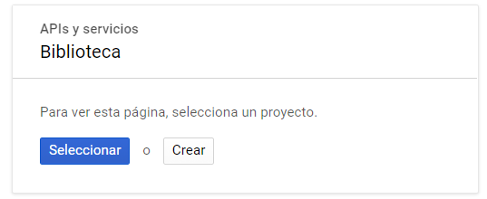

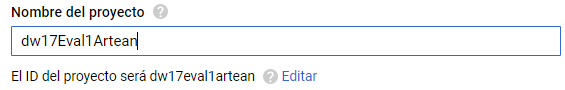

17. Google Api console

### Habilitar el servicio de Google+ API

3.  En la lista de Google APIs, lanzamos la búsqueda del
    servicio **Google+ API**.

4.  Seleccionamos **Google+ API** de la lista de resultados

5.  Pulsamos **Habilitar API**. Esperamos hasta que se haya activado

> 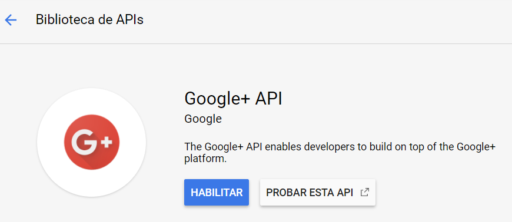

18. Habilitar Google+ P

### Generar credenciales

En la barra de configuración de la izquierda accedemos a la opción de
**Credenciales**.

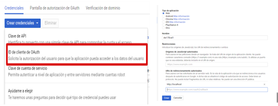

19. Generar credenciales

Desde la casilla dialogo copiamos los ID Cliente e ID secreto para que
nuestra aplicación pueda conectarse mediante Google API.

Necesitamos obtener la biblioteca cliente para las APIs de Google,
[https://github.com/google/google-api-php-client](https://github.com/google/google-api-php-client).
La mejor manera de gestionar las dependencias de nuestro proyecto es a
través de **Composer**.


20. Composer

### Composer: Gestión de dependencias

Composer en un gestor de dependencias de PHP, descarga el archivo
**phar** de la última versión desde la web
[https://getcomposer.org/download/](https://getcomposer.org/download/).

En nuestro entorno de desarrollo NetBeans debemos enlazar este archivo
para poder acceder a las funcionalidades del gestor de dependencias.
Desde la pestaña de Herramientas, Opciones, PHP, tenemos un menú para la
configuración de herramientas y frameworks. En esta pestaña debemos
seleccionar Composer y establecer la ruta al archivo que nos hemos
descargado.

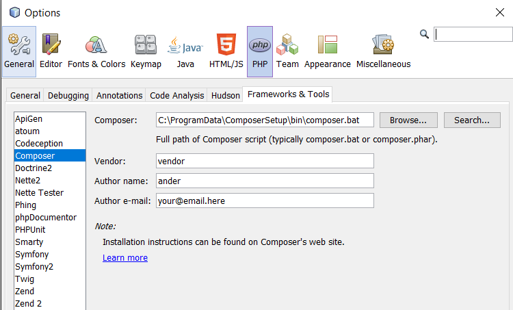

21. Figure 2. Configurar Composer

Una vez realizado este paso en el menú desplegable (botón derecho encima
del proyecto), nos aparece la opción de Composer. Seleccionamos Init, lo
cual nos genera el archivo JSON para la configuración de las
dependencias. En este archivo debemos añadir la dependencia del cliente
de google api.

> \"require\": {
>
> \"google/apiclient\": \"1.1.\*\"
>
> }

22. Añadir dependencia

Una vez realizado este paso instalamos y validamos las dependencias a
través de Composer.

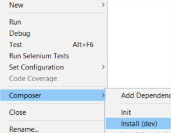

23. Instalar dependencias

Podemos realizar el seguimiento del proceso desde la consola de
Composer. Una vez finalizado el proceso se añade a nuestro proyecto la
carpeta vendor, donde se almacenan las dependencias establecidas en el
archivo json.

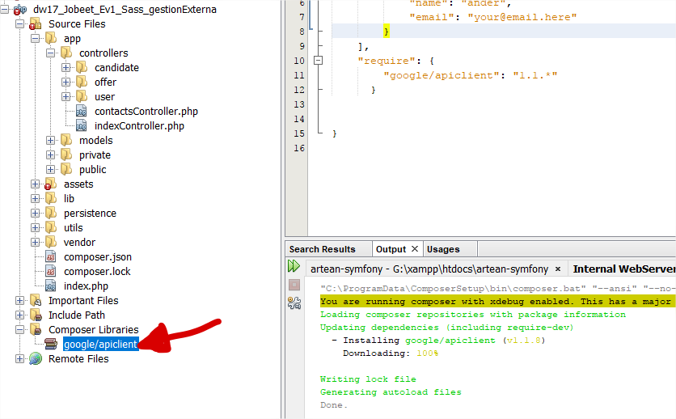

24. Google API Client

### Integrar acceso vía Google

Google Sign-In administra el ciclo de vida del token y el flujo de OAuth
2.0, simplificando su integración con las API de Google. Un usuario
siempre tiene la opción de revocar el acceso a una aplicación en
cualquier momento.

Este documento describe cómo completar una integración básica de inicio
de sesión en Google.

Cargar la biblioteca de la plataforma Google
````js
    <script src="https://apis.google.com/js/platform.js" async defer></script>
````
#### Especificar el ID de cliente en tu aplicación

Especifique la ID de cliente que creó para su aplicación en Google
Developers Console con el meta elemento google-signin-client\_id.

````js
<meta name="google-signin-client\_id\"
content="YOUR\_CLIENT\_ID.apps.googleusercontent.com">
````


#### Añadir un botón de registro

La forma más fácil de agregar un botón de inicio de sesión de Google a
su sitio es utilizar un botón de inicio de sesión prestado
automáticamente. Con solo unas pocas líneas de código, puede agregar un
botón que se configura automáticamente para tener el texto, el logotipo
y los colores apropiados para el estado de inicio de sesión del usuario
y los ámbitos que solicita.

Para crear un botón de inicio de sesión de Google que usa la
configuración predeterminada, agregue un elemento div con la clase
g-signin2 a su página de inicio de sesión:

````html
<div class="g-signin2" data-onsuccess="onSignIn"></div>
````

El resultado se muestra a continuación:


25. Google Acceder

#### Obtener información de perfil

Después de que haya iniciado sesión en un usuario con Google utilizando
los ámbitos predeterminados, puede acceder al ID de Google, al nombre, a
la URL del perfil y a la dirección de correo electrónico del usuario.

Para recuperar información de perfil de un usuario, use el método
getBasicProfile ().

````php
function onSignIn(googleUser) {
  var profile = googleUser.getBasicProfile();
  console.log('ID: ' + profile.getId()); // Do not send to your backend! Use an ID token instead.
  console.log('Name: ' + profile.getName());
  console.log('Image URL: ' + profile.getImageUrl());
  console.log('Email: ' + profile.getEmail()); // This is null if the 'email' scope is not present.
}
````


Salir del registro

````
<script>
  function signOut() {
    var auth2 = gapi.auth2.getAuthInstance();
    auth2.signOut().then(function () {
      console.log('User signed out.');
    });
  }
</script>
````

> Google Developers, 2018. Recuperado de:
> [https://developers.google.com/identity/sign-in/web/sign-in]](https://developers.google.com/identity/sign-in/web/sign-in)

Envió de correos
----------------

Añade a tu proyecto una página de contacto donde se aprecie un mapa con
la localización y un formulario para el contacto mediante correo.

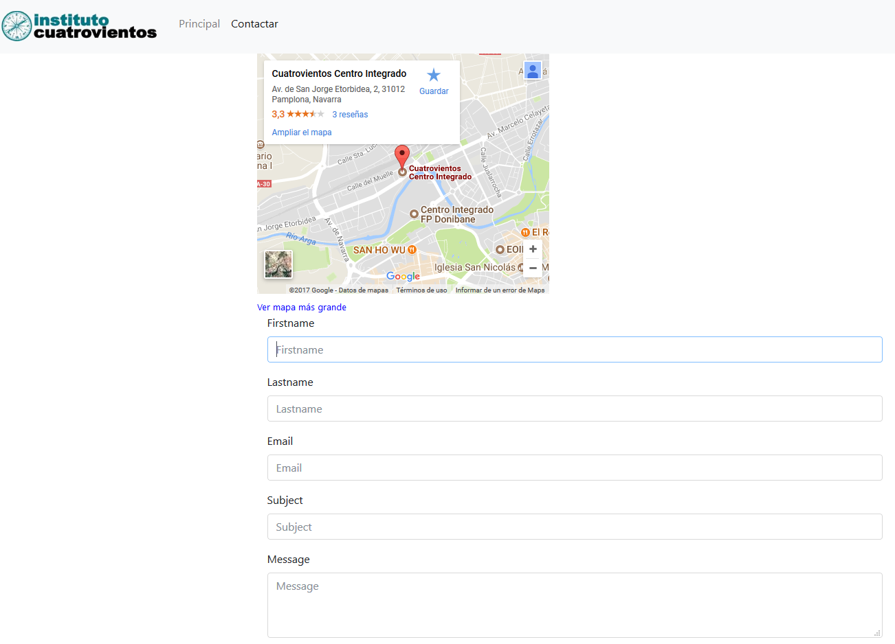{width="2.5107272528433944in"
height="1.4570133420822398in"}

26. Página de contacto

### PHP Mailer

Clase PHP completa de funcionalidades necesarias para la creación y
transferencia de correos.

En la pantalla de contacto de nuestra aplicación web disponemos de un
formulario con el que los usuarios pueden contactar con nosotros.

Vamos a realizar un ejemplo básico de utilización de Gmail desde PHP.
Para lo que vamos a hacer uso de la clase PHPMailer,
[https://github.com/PHPMailer/PHPMailer]](https://github.com/PHPMailer/PHPMailer)

#### Requisitos

Debemos de disponer en nuestro proyecto de dos clases PHP; PHPMAILER.php
y SMTP.php.

Genera una carpeta llamada PHPMailer y añade dos archivos php de clase
con nombre PHPMAILER y SMTP. Dentro de estas dos añadimos el código
correspondiente, puedes obtenerlo desde GitHub.

-   PHPMAILER:
    [https://github.com/PHPMailer/PHPMailer/blob/master/class.phpmailer.php]](https://github.com/PHPMailer/PHPMailer/blob/master/class.phpmailer.php)

-   SMTP:
    [https://github.com/PHPMailer/PHPMailer/blob/master/class.smtp.php]](https://github.com/PHPMailer/PHPMailer/blob/master/class.smtp.php)

#### Clase enviar correo

En la misma carpeta creamos un archivo php donde se establecerá la
función encargada de gestionar el envió de correos a través de Gmail.

````php
<?php
function enviarGmail() {
    require_once('PHPMAILER.php');
//include("class.smtp.php"); // optional, gets called from within class.phpmailer.php if not already loaded
    $mail = new PHPMailer();
    $mail->IsSMTP(); // telling the class to use SMTP
    $mail->Host = "mail.yourdomain.com"; // SMTP server
    $mail->SMTPDebug = 2; // enables SMTP debug information (for testing)
    // 1 = errors and messages
    // 2 = messages only
    $mail->SMTPAuth = true;      // enable SMTP authentication
    $mail->SMTPSecure = "tls";   // sets the prefix to the servier
    $mail->Host = "smtp.gmail.com";      // sets GMAIL as the SMTP server
    $mail->Port = 587;   // set the SMTP port for the GMAIL server
    $mail->Username = "*****";  // GMAIL username
    $mail->Password = "*****";  // GMAIL password
    $mail->SetFrom('name@yourdomain.com', 'First Last');
    $mail->AddReplyTo("name@yourdomain.com", "First Last");
    $mail->Subject = "PHPMailer Test Subject via smtp (Gmail), basic";

    $mail->AltBody = "To view the message, please use an HTML compatible email viewer!"; // optional, comment out and test

    // Completamos el mensaje
    $body = "ojuu";
    $mail->MsgHTML($body);
    $address = "****";// DESTINATARIO
    $mail->AddAddress($address, "John Doe");

    $mail->AddAttachment("images/phpmailer.gif");      // attachment
    $mail->AddAttachment("images/phpmailer_mini.gif"); // attachment
    if (!$mail->Send()) {
        echo "Mailer Error: " . $mail->ErrorInfo;
    } else {
        echo "Message sent!";
    }
}
?>
`````

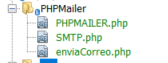

27. Carpeta PHPMailer

Puedes obtener más información del siguiente manual:
[http://www.lubrimor.com/admin/imagenes/producto/03\_04\_2012\_09\_10\_06\_811219648.pdf](http://www.lubrimor.com/admin/imagenes/producto/03_04_2012_09_10_06_811219648.pdf)

#### Actividad

Generación de la pantalla de contactos.

Los alumn\@s deben modificar la lógica de la función para él envió desde
gmail, añadiendo los elementos introducidos por el usuario desde el
formulario.

Es necesario activar
[https://www.google.com/settings/security/lesssecureapps](https://www.google.com/settings/security/lesssecureapps)

¿Qué pasa si no lo hacemos?

Bibliografía

Sánchez González, L.J. (2016). Aprende PHP con Ejercicios. Madrid:
leanpub.

Bahit, E. (2011). POO y MVC en PHP.

PHP. (2017). PHP: Hypertext Preprocessor.
[https://secure.php.net](https://secure.php.net)

Place, E. ( 2009). Programación Orientada a Objetos para PHP5. 2009:
surforce.

Pérez Martínez, E. (2015/2016). En Desarrollo web en entorno servidor.
ITC Cuatrovientos.

Lázaro, D. (2015). Guía de PHP. leanpub.

Clases abstractas en PHP. (2018). Recuperado de
[https://diego.com.es/clases-abstractas-en-php](https://diego.com.es/clases-abstractas-en-php)

Gil, F., Romaní, A. (2010). Aprende Drupal. Sevilla: Publidisa.

MySQL.
En *Wikipedia*. [https://es.wikipedia.org/wiki/MySQL](https://es.wikipedia.org/wiki/MySQL)

phpMyAdmin.
En *Wikipedia*. [https://es.wikipedia.org/wiki/PhpMyAdmin]](https://es.wikipedia.org/wiki/PhpMyAdmin)

El tutorial Jobeet. (2018). Recuperado de:
[http://librosweb.es/libro/jobeet\_1\_4](http://librosweb.es/libro/jobeet_1_4)
